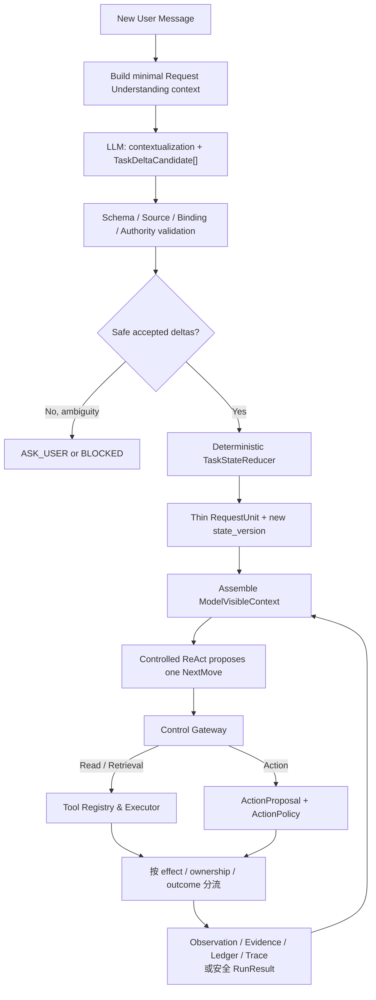

# 消费者订单与配送售后 Agent｜Intent / Request Understanding Design Reference

更新日期：2026-07-28
文档状态：P0 规范性目标设计  
适用读者：Agent、应用、业务、测试和 Eval 研发人员

> 本文定义 P0 的 Request Understanding、Query 上下文化、`TaskDeltaCandidate`、输入绑定、确定性校验和 `RequestUnit` 写入契约。本文是目标设计，不表示仓库中已经存在可运行实现、模型配置、数据库表或自动化测试。

## 1. 文档所有权与适用边界

本文是 Request Understanding 专项设计 owner，负责回答：

- “意图识别”在当前项目中究竟输出什么。
- 什么时候需要 Query 上下文化，什么内容禁止改写。
- 多意图如何拆成持久用户目标，什么不应拆成 `RequestUnit`。
- Slot 如何提取、验证、绑定和失效。
- 模型候选如何经过确定性代码写入 Task State。
- Request Understanding 与 Controlled ReAct、Tool、Observation、Evidence、Action Ledger 如何分工。
- 这一能力如何记录 Trace，并通过 Component、Trajectory 和 E2E Eval 验证。

本文不重新拥有以下语义：

| 范围 | Canonical owner |
|---|---|
| P0 用户目标、两条 E2E、Tool Catalog、Mock 系统、业务验收 | [`docs/business-capabilities.md`](../business-capabilities.md) |
| Runtime 主干、Controlled ReAct 与 ActionPolicy 上位方向 | [`PROJECT_DIRECTION.md`](../../PROJECT_DIRECTION.md) |
| Eval-driven development、通用 EvalCase、Dataset、Grader 与 Gate | [`Agent Evaluation Strategy`](../evaluation/agent-evaluation-strategy.md) |
| P0 Case ID、requirement mapping、Critical failure 与激活状态 | [`P0 Eval Coverage Matrix`](../evaluation/p0-eval-coverage-matrix.md) |
| Tool Registry / Executor、工具集快照、Control Gateway 工具校验、ToolCall 生命周期、超时与中断 | [`tool-calling-design-reference.md`](tool-calling-design-reference.md) |
| Task Working Context、Observation、Evidence、Action Ledger、Context Manifest | [`memory-design-reference.md`](memory-design-reference.md) |
| 当前图形基线及配套视图 | [`docs/architecture/README.md`](README.md) |

发生冲突时，专门 owner 只在自身范围内优先：

1. 业务范围和 P0 是否支持某项售后能力，以 `business-capabilities.md` 为准。
2. 状态、权威性、持久化引用和动作记录，以 Memory Design Reference 为准。
3. Tool 注册、模型可见工具集、Gateway 工具校验和执行生命周期，以 Tool Calling Design Reference 为准。
4. 本文只细化 Request Understanding 契约，不得借“意图识别”新增 P0 业务范围、工具或动作。

### 1.1 本次契约裁决

此前 active 文档以 `RequestUnitCandidate[]` 表示模型拆分结果，并将订单定位、工具查询、确定性判断、RAG 检索和动作恢复都示例化为独立 `RequestUnit`。这容易产生两个问题：

1. 把 Runtime 中间步骤误当成用户意图，导致 `RequestUnit` 过度膨胀。
2. 为每类 `RequestUnit` 继续增加 `required_arguments`、`allowed_tools` 或固定流程，重新形成隐式 Capability Registry。

P0 现统一采用：

```text
Goal Delta + Thin RequestUnit + Controlled ReAct
```

即：

- 模型输出开放目标的 `TaskDeltaCandidate[]`，不输出业务 Intent 分类。
- 确定性 Runtime 校验候选，并用 Reducer 写入薄 `RequestUnit`。
- 一个 `RequestUnit` 表示一个可被用户感知、可独立完成或取消的持久目标。
- 订单定位、ToolCall、RAG 检索、确定性派生、授权检查和动作恢复是目标的推进步骤，不是新的用户意图。
- 工具由 Controlled ReAct 根据目标和最新 Observation 从全局 Tool Registry 动态选择。

## 2. 核心结论

当前项目保留“多意图”这一产品术语，但不建设封闭的 Intent Classifier。

这里的“意图识别”实际是：

> 在收到一条新的用户消息时，基于最小必要上下文，识别它对零到多个开放用户目标造成的增量变化，并生成带来源、可验证的 `TaskDeltaCandidate`。

“谢谢”“知道了”等不改变目标的消息可以输出空数组；系统不能为了满足分类格式强行制造一个业务目标。

P0 的六项强制原则：

1. **开放目标，不做业务标签路由。** `goal_text` 描述用户要完成的结果，不映射到 `intent_type` 或 `capability`。
2. **增量更新，不重建整个任务。** 新消息只表达新增、修正、补充、取消或确认候选。
3. **候选不是事实。** 用户消息和模型输出只能形成 Claim、Reference Candidate 或状态变更候选。
4. **Query 上下文化与原文并存。** `contextualized_query` 永远不能覆盖 `original_query`。
5. **Slot 按需绑定，不做全局填表。** 只有当前目标的下一步确实需要且无法从可信系统取得的信息，才可以成为开放问题。
6. **理解与执行分开。** Task Delta 不携带工具白名单、Handler 或 Workflow；副作用意愿也不等于动作授权。

## 3. 核心概念与不可混用边界

| 概念 | 作用域 | 产生者 | 是否可直接写入权威状态 |
|---|---|---|---:|
| `original_query` | 当前消息 | Conversation API / Store | 原文可保存，但不证明业务事实 |
| `contextualized_query` | 当前 Request Understanding | 模型候选 + Runtime 校验 | 否；durable audit projection 本身必须保存，不能从消息或最终状态重建或猜回；仅后续模型调用的普通上下文可由受控来源重组 |
| `TaskDeltaCandidate` | 当前用户消息 | 模型 | 否 |
| `AcceptedTaskDelta` | 当前状态变更 | Candidate Validator | 只能交给确定性 Reducer |
| `RequestUnit` | L2 Task Working Context | Task State Reducer | 是，对任务推进状态有权威性 |
| `NextMove` | 单次 ReAct step | 模型候选 + Control Gateway | 否，只是下一步候选 |
| `ToolCall` | 单次执行 | Tool Registry & Executor | 只记录执行生命周期；结果按 effect、归属与 outcome 分流，不自动形成 Observation |
| `Observation` | 某个时间点的业务事实 | 受控 Business Tool / API | 对该时点观察有权威性 |
| `EvidenceBinding` | 某个判断所用知识依据 | Retriever + Evidence Assembler | 对指定版本、用途和适用范围有效 |
| `ActionProposal` | 待确认副作用方案 | Runtime 确定性组装 | 保存于 Action Ledger |
| `ConfirmationCandidate` | 当前用户消息 | 模型 | 否，必须精确绑定并校验 |
| `ActionConfirmation` | 某个精确方案的确认 | Runtime | 保存于 Action Ledger |

关键边界：

- `TaskDeltaCandidate` 不是 `RequestUnit`。
- `RequestUnit` 不是 Intent 标签，也不是 Workflow 节点。
- `NextMove` 不是长期任务状态。
- 用户说“包裹五天没更新”是 Claim，不是 `ShipmentObservation`。
- 用户说“确认退款”是 Confirmation Candidate，不是有效确认本身。
- `ELIGIBLE` 是确定性资格结果，不是模型意图。
- `create_refund` 返回 `COMPLETED` 是 Mock 动作结果，不代表真实支付渠道到账。

## 4. 多意图与 RequestUnit 粒度

### 4.1 拆分标准

一个用户可感知、可独立完成或取消、具有自己结果生命周期的目标，对应一个 `RequestUnit`。

满足任一条件时，通常应拆分：

- 用户请求两个可以分别完成或失败的结果。
- 两个目标指向彼此独立的订单、商品或退款对象。
- 其中一个目标需要独立的副作用确认和结果生命周期。
- 用户明确给出先后、条件或取消边界。

以下内容不得因为“系统需要做一步”就拆成新的 `RequestUnit`：

- 定位订单或商品。
- 调用 `search_orders`、`get_order` 或 `get_shipment`。
- 检索退款政策。
- 标准化 ToolResult。
- 判断配送异常或退款资格。
- 生成待确认退款方案。
- 执行归属、授权、Evidence、新鲜度或幂等校验。
- 对 `RESULT_UNKNOWN` 进行查询恢复。

这些都是一个用户目标内部的动态推进、确定性派生或动作生命周期。

### 4.2 黄金场景

输入：

> “订单 O-1001 的包裹五天没更新了，帮我查一下，如果符合条件就退款。”

应形成两个用户目标：

```text
RU-1：查询订单 O-1001 关联包裹的当前状态，并解释是否异常。
RU-2：若当前事实与政策判定符合条件，则在生成精确方案并获得确认后创建模拟退款。
```

两者可以属于同一个 Task，`RU-2` 带有用户条件并可依赖 `RU-1` 的结果。以下内容不是额外 RequestUnit：

```text
本人订单归属校验
→ 物流查询
→ 配送异常确定性判断
→ 政策 Evidence 检索
→ 退款资格确定性判断
→ 方案生成
→ 精确确认
→ ActionPolicy
→ create_refund
→ RESULT_UNKNOWN 恢复
```

这条推进路径由 Controlled ReAct、确定性派生和动作门禁共同形成，不写成固定 DAG。

### 4.3 Task 分组

- 相同业务对象、共享上下文并具有因果或条件关系的多个 RequestUnit，可以放在同一个 Task。
- 查询两个无关订单的两个目标，应建立两个 Task 或两个可独立推进的 Task 分支。
- 一条消息可以更新多个 Task。
- 一个 Task 可以跨 Conversation 恢复。
- Task 绑定不确定时必须 `ASK_USER`，不能把状态写入“最像”的历史 Task。

## 5. Request Understanding 输入

### 5.1 两阶段 Context Assembly 中的第一阶段

Request Understanding 只接收：

```text
当前 message_ref 与 original_query
+ 最近 Conversation 投影
+ pending_question 的模型安全投影
+ 当前 Conversation 关联的活动 Task 最小索引
+ 可选 focused_task 的模型安全摘要
+ Runtime 给出的输出 Schema 与安全约束
```

活动 Task 索引最多暴露：

- 模型安全的 `task_alias` / `request_unit_alias`。
- 用户可识别的最小目标摘要。
- 当前状态和开放问题。
- 已脱敏的目标标签。
- 模型可见的 pending action 摘要及安全别名；只在判断确认候选时提供。

不得进入 Request Understanding 模型上下文：

- `customer_id`、认证主体、Token、Session 或授权范围原文。
- 未经本轮归属校验的私有资源内容。
- 原始 ToolResult。
- 无界历史 Task、完整 Conversation 或不必要 PII。
- 将历史摘要当作业务事实或确认的指令。

如果同一次模型调用还要提出 `next_move_candidate`，可以额外投影当前 P0 的 Agent-visible ToolSpec；ToolSpec 只用于候选规划，不用于给 Task Delta 增加工具白名单。

### 5.2 推荐输入契约

```text
RequestUnderstandingInput
  schema_version
  run_id
  message_ref
  original_query
  recent_message_refs[]
  pending_question?
  active_task_summaries[]
  focused_task_summary?
  pending_action_summaries[]
  output_constraints
```

`run_id` 和记录引用用于 Trace 与绑定，不代表模型可以自行加载对应私有记录。

这里的 `RequestUnderstandingInput.schema_version` 表示本次模型实际接收的 **model input schema version**。它不是持久化逻辑记录的 `record_schema_version`，也不能从模型输出版本、Prompt 版本或 Task `state_version` 推断；第 13 节要求将它作为独立审计维度保存。

## 6. Query 上下文化

### 6.1 为什么需要

售后消息经常依赖省略和指代：

- “第二个。”
- “还是没有。”
- “就按刚才那个退。”
- “不是鞋，是耳机。”

因此 P0 需要 Query 上下文化，但它只是语言理解投影，不是业务判断。

### 6.2 输出契约

```text
QueryContextualizationCandidate
  text
  resolved_reference_candidates[]
  uncertainties[]
  source_message_refs[]
```

每个引用候选至少包含：

```text
name
candidate_value
source_kind
source_ref
source_quote?
confidence
```

### 6.3 强制规则

1. `original_query` 必须以不可变消息原文保存。
2. `contextualized_query` 单独保存；没有省略时可以与原文语义等价。
3. 只补全上下文中已有且可追溯的信息。
4. 多个引用同样合理时不替用户选择，写入 `uncertainties` 并触发 `ASK_USER`。
5. 不生成、补全或显示 `customer_id`。
6. 不把 User Claim 改写成业务事实。
7. 不判断配送异常、退款资格、动作成功、失败或超时。
8. 不把历史 Memory 当作最新 Observation。
9. 不添加 Tool 名、执行命令或隐藏 Workflow。
10. 检索 Query 的扩展属于后续 Retriever，不与对话上下文化混为一体。

示例：

```json
{
  "original_query": "还是没有",
  "contextualized_query": {
    "text": "查询订单 O-1001 的模拟退款状态；用户表示目前仍未看到完成结果",
    "resolved_reference_candidates": [
      {
        "name": "order_id",
        "candidate_value": "O-1001",
        "source_kind": "RECENT_MESSAGE",
        "source_ref": "msg_prev_4",
        "confidence": 0.96
      }
    ],
    "uncertainties": [],
    "source_message_refs": ["msg_current", "msg_prev_4"]
  }
}
```

不能改写成：

```text
订单 O-1001 的退款已经超时或失败。
```

## 7. TaskDeltaCandidate 契约

### 7.1 稳定操作集合

`TaskDeltaCandidate` 只使用跨领域稳定的状态操作：

| Operation | 含义 | 典型输入 |
|---|---|---|
| `ADD_GOAL` | 新增一个持久用户目标 | “帮我查物流” |
| `AMEND_GOAL` | 修正现有目标、对象或约束 | “不是第二个，是第一个订单” |
| `SUPPLY_INPUT` | 回答当前开放问题或补充目标输入 | “数量是 1 件” |
| `CANCEL_GOAL` | 取消尚未完成的用户目标 | “算了，不查了” |
| `CONFIRMATION_CANDIDATE` | 用户可能在确认一个待处理精确方案 | “确认按刚才方案退款” |

这些 Operation 是 Task 状态操作，不是业务 Intent。P0 不增加：

```text
ORDER_QUERY
SHIPMENT_DELAY
REFUND_ELIGIBILITY
CREATE_REFUND
```

之类的生产路由标签。

Operation 的目标绑定要求：

| Operation | 必要绑定 |
|---|---|
| `ADD_GOAL` | 必须提供 `goal_patch`；不得伪造既有 Task / RequestUnit |
| `AMEND_GOAL` | 必须绑定上下文中显式提供的 `target_request_unit_alias` |
| `SUPPLY_INPUT` | 必须绑定唯一开放问题或对应 RequestUnit |
| `CANCEL_GOAL` | 必须绑定尚可取消的 RequestUnit；只取消 Agent 目标 |
| `CONFIRMATION_CANDIDATE` | 必须绑定模型上下文中的 `target_action_alias`；Runtime 仍需精确校验 |

### 7.2 推荐输出契约

```text
RequestUnderstandingOutput
  schema_version
  message_ref
  contextualization
  task_delta_candidates[]
  next_move_candidate?

TaskDeltaCandidate
  candidate_id
  operation
  target_task_alias?
  target_request_unit_alias?
  target_action_alias?
  goal_patch?
  input_candidates[]
  constraints[]
  dependency_candidates[]
  uncertainties[]
  confidence
```

字段说明：

- `target_*_alias` 只能引用本轮模型上下文中显式提供的安全别名。
- `goal_patch` 是开放自然语言目标或修正内容，不是 Intent 名。
- `input_candidates` 是带来源的候选绑定，不是已验证事实。
- `constraints` 保留用户说出的条件，例如“如果符合条件”。
- `dependency_candidates` 只描述目标之间的顺序或条件关系，不包含 Tool 顺序。
- `confidence` 只用于诊断和歧义处理，不构成授权、事实或确认。

这里的 `RequestUnderstandingOutput.schema_version` 表示通过严格校验的 **model output schema version**。它不是 `RequestUnderstandingRecord` 的逻辑 `record_schema_version`；即使两个版本在某个切片中碰巧使用相同字符串，实现也必须把它们当作两个独立版本轴。

### 7.3 黄金场景候选示例

```json
{
  "schema_version": "intent-ref.p0.v1",
  "message_ref": "msg_101",
  "contextualization": {
    "text": "查询本人订单 O-1001 关联包裹的当前状态并判断是否异常；如果当前事实与退款政策符合条件，则准备模拟退款",
    "resolved_reference_candidates": [
      {
        "name": "order_id",
        "candidate_value": "O-1001",
        "source_kind": "CURRENT_MESSAGE",
        "source_ref": "msg_101",
        "source_quote": "订单 O-1001",
        "confidence": 0.99
      }
    ],
    "uncertainties": [],
    "source_message_refs": ["msg_101"]
  },
  "task_delta_candidates": [
    {
      "candidate_id": "delta_1",
      "operation": "ADD_GOAL",
      "goal_patch": {
        "text": "查询订单 O-1001 关联包裹的当前状态，并解释是否异常",
        "source_ref": "msg_101"
      },
      "input_candidates": [
        {
          "name": "order_id",
          "candidate_value": "O-1001",
          "semantic_role": "RESOURCE_REFERENCE",
          "authority": "USER_CLAIM",
          "source_kind": "CURRENT_MESSAGE",
          "source_ref": "msg_101",
          "source_quote": "订单 O-1001",
          "confidence": 0.99
        },
        {
          "name": "claim_text",
          "candidate_value": "用户称包裹五天没有更新",
          "semantic_role": "USER_ASSERTION",
          "authority": "USER_CLAIM",
          "source_kind": "CURRENT_MESSAGE",
          "source_ref": "msg_101",
          "source_quote": "包裹五天没更新了",
          "confidence": 0.98
        }
      ],
      "constraints": [],
      "dependency_candidates": [],
      "uncertainties": [],
      "confidence": 0.97
    },
    {
      "candidate_id": "delta_2",
      "operation": "ADD_GOAL",
      "goal_patch": {
        "text": "若当前事实与政策判定符合条件，则在精确确认后创建模拟退款",
        "source_ref": "msg_101"
      },
      "input_candidates": [],
      "constraints": [
        {
          "text": "只有符合退款条件时才继续",
          "source_ref": "msg_101",
          "source_quote": "如果符合条件就退款"
        }
      ],
      "dependency_candidates": [
        {
          "on_candidate_id": "delta_1",
          "relation": "USES_RESULT"
        }
      ],
      "uncertainties": [],
      "confidence": 0.95
    }
  ]
}
```

Runtime 仍需验证 `O-1001` 是否属于当前用户；“五天没更新”不能直接形成 Shipment Observation；`delta_2` 也不能直接触发 `create_refund`。

### 7.4 Task Delta 中禁止出现的字段

以下字段一旦出现在 Task Delta 内，应由 Schema Validator 拒绝：

```text
intent_type
capability
required_arguments
allowed_tools
handler
workflow
workflow_step
customer_id
authorization_scope
tool_name
tool_arguments
eligibility_result
action_result
```

`next_move_candidate` 可以在自己的独立 Schema 中提出 Tool，但不能把 Tool 写回 RequestUnit。

## 8. 确定性校验与状态写入

### 8.1 校验顺序

```text
LLM output
  → Schema Validator
  → Source & Provenance Validator
  → Task / Action Alias Resolver
  → Goal Boundary & Dedup Validator
  → Dependency Validator
  → Confirmation Binder
  → AcceptedTaskDelta[]
  → TaskStateReducer
  → new Task / RequestUnit state_version
```

### 8.2 必须执行的检查

| 检查 | 拒绝或降级条件 |
|---|---|
| Schema | 版本、Operation、字段或类型不合法 |
| 来源 | 候选值没有 `source_ref`，或 `source_quote` 不在对应消息中 |
| 私有边界 | 模型生成 `customer_id`、授权范围或未投影私有引用 |
| Task 绑定 | 目标别名不存在、不活动或不在当前可信加载范围 |
| Goal 粒度 | 把 ToolCall、RAG、判断或 Gate 拆成用户目标 |
| 去重 | 与当前活动目标语义重复，却再次 `ADD_GOAL` |
| 依赖 | 引用不存在、自依赖或形成循环 |
| Authority | 将 Claim / Inference 标记为 Observation、Evidence 或已确认事实 |
| Confirmation | 没有唯一、有效、参数未变的 pending proposal |
| Cancellation | 将“取消当前目标”误解为取消订单、撤销退款等未注册业务动作 |

这里的“确定性校验”是指 Schema、安全边界、引用、版本和状态迁移由程序稳定执行，不表示普通代码可以完全证明两个自然语言 Goal 是否语义相同。Goal 边界和语义重复首先由模型提出；Runtime 只做保守合并，无法可靠判定时保留独立候选或 `ASK_USER`。语义去重实现仍需由 Dataset 和 Eval 裁决。

### 8.3 部分有效输出

- 多个彼此独立的 Candidate 可以逐个校验。
- 接受部分 Candidate 后，如果原 `next_move_candidate` 依赖被拒绝或被修改的 Candidate，必须丢弃它。
- 目标、Task 绑定或动作确认仍有高风险歧义时返回 `ASK_USER`。
- Schema 整体损坏、候选互相矛盾或无法安全部分应用时，不写状态；可以受预算限制重试一次结构化理解，否则 `ASK_USER` 或 `BLOCKED`。

### 8.4 Reducer 规则

模型不能直接写 Task State。Reducer 至少保证：

- `ADD_GOAL` 创建薄 RequestUnit，并进行语义去重。
- `AMEND_GOAL` 增加 `state_version`，保留修正来源，并使依赖旧目标或旧绑定的派生结果、Evidence Binding 和 Pending Action 失效。
- `SUPPLY_INPUT` 只绑定到当前开放问题，不把任意文本写成已验证事实。
- `CANCEL_GOAL` 只改变 Task / RequestUnit 状态；已经开始的副作用必须按 Action Ledger 和业务系统状态处理。
- `CONFIRMATION_CANDIDATE` 通过精确绑定后写 Action Ledger；确认失效规则服从 Memory Design Reference。

P0 不要求完整 Event Sourcing，但应能记录：

```text
TaskDeltasValidated
TaskGoalAdded
TaskGoalAmended
TaskInputSupplied
TaskGoalCancelled
ActionConfirmationRecorded
```

## 9. 薄 RequestUnit

### 9.1 推荐契约

```text
RequestUnit
  request_unit_id
  task_id
  goal_text
  goal_source_refs[]
  contextualization_ref?
  constraint_refs[]
  dependency_refs[]
  input_binding_refs[]
  open_questions[]
  observation_refs[]
  evidence_binding_refs[]
  pending_action_ref?
  result_refs[]
  status
  state_version
  created_at
  updated_at
```

其中：

- `goal_text` 是开放用户目标。
- `input_binding_refs` 指向通过 Runtime 校验的输入绑定；它们仍可能只是 User Claim。
- `open_questions` 是当前安全推进真正缺少的信息，不是某个 Intent 的固定必填表。
- `observation_refs`、`evidence_binding_refs`、`pending_action_ref` 和 `result_refs` 只保存引用，不复制其他权威域内容。
- `status` 服从 Memory Design Reference 的 Task 状态语义。

### 9.2 RequestUnit 不保存

```text
intent_type
capability
required_arguments
allowed_tools
handler
workflow
固定 Tool 顺序
customer_id 的模型可见副本
业务事实正文
政策正文
确认或副作用结果副本
```

Tool Schema 可以定义一次 ToolCall 所需参数；ActionProposal 可以定义一次退款动作的精确参数。这些都不应反向变成 RequestUnit 的固定 Slot 表。

## 10. Slot / Input Binding 设计

### 10.1 Slot 的定位

P0 仍可以使用“Slot”作为沟通词，但实现契约统一称为 `InputBinding`。

Slot 不是：

- 每种 Intent 的必填字段清单。
- 模型写入业务事实的入口。
- `customer_id` 的来源。
- Observation、Evidence 或动作确认的替代品。
- 决定允许调用哪些 Tool 的依据。

### 10.2 五类绑定

| 类型 | 示例 | 来源与权威性 | 模型可否产生 |
|---|---|---|---:|
| Candidate Input | 用户输入的 `order_id`、商品描述、原因说明 | User Claim / Model Inference | 可以，只是候选 |
| Runtime Private Binding | `customer_id`、授权范围 | 服务端可信上下文 | 不可以 |
| Verified Target Ref | 已验证归属的 `order_ref`、`item_ref`、`refund_ref` | 业务 API + Runtime | 不可以 |
| Observation / Evidence Ref | 物流观察、政策绑定 | 受控工具与 Evidence Assembler | 不可以 |
| Action Parameter Binding | 商品、数量、金额、方式、方案版本 | 确定性方案 + Action Ledger | 模型只能提议，不能最终绑定 |

### 10.3 Candidate Input 最小字段

```text
InputCandidate
  name
  candidate_value
  semantic_role
  authority: USER_CLAIM | MODEL_INFERENCE
  source_kind
  source_ref
  source_quote?
  confidence
```

Runtime 校验后形成：

```text
InputBinding
  binding_id
  name
  normalized_value
  authority
  source_refs[]
  validation_status
  verified_target_ref?
  confirmed_by_user
  created_at
  updated_at
  supersedes?
```

模型给出的 `authority` 本身仍不可信。Runtime 必须根据 `source_kind` 和实际来源重新判定；模型只能提出 `USER_CLAIM` 或 `MODEL_INFERENCE`，不能声明 `BUSINESS_OBSERVATION`、`RAG_EVIDENCE` 或 `ACTION_CONFIRMATION`。

`verified_target_ref` 是新的受控引用，不是把原 Candidate 原地“升级成事实”。

### 10.4 InputBinding 与 NextMove 参数绑定

模型在 `NextMove.arguments` 中给出的业务参数仍然只是候选。对于来自用户消息、模型抽取或既有 Task Working Context 的资源与业务参数，Runtime 必须在 Control Gateway 接受前完成确定性绑定：

1. `Source & Provenance Validator` 先把合法 Candidate 规范化为 `InputBinding`，并由 Reducer 将其引用写入对应 RequestUnit。
2. 每个模型可见业务参数必须能够精确追溯到当前有效的 `InputBinding`、`verified_target_ref`、Observation / Evidence 引用或 Action Parameter Binding；不能只因为通过 Tool JSON Schema 就接受。
3. Gateway 比较规范化后的候选参数与受控绑定。值、来源、Task、RequestUnit 或版本任一不一致时，以稳定原因 `ARGUMENT_BINDING_MISMATCH` 拒绝；不创建 ToolCall，也不调用 Handler。
4. 接受时，Gateway / `AuthorizedToolCommand` 保存安全的 `argument_binding_refs[]`。Handler 只接收受控命令，不直接消费模型原始 `NextMove.arguments`。
5. `customer_id`、授权范围、幂等键等 Runtime Private Binding 仍由服务端注入，不通过 `InputBinding` 或模型参数传递。

该规则不把 RequestUnit 变成固定 Slot 表，也不让 InputBinding 决定允许调用哪些 Tool；它只证明本次候选参数来自当前目标的有效受控来源。

#### 10.4.1 Cycle 2 durable InputBinding version boundary

Phase 1 的 `input_binding_record.p0.v1` owner model 只接受 exact `order_id` string。
Cycle 2 需要 string / strict integer / strict boolean 的 name-value closed matrix，属于
durable shape 与 closure 的 breaking change，必须使用
`input_binding_record.p0.v2` / `InputBindingV2`；不得原地扩大 v1 model 后继续写 v1
envelope。v1→v2 只允许已通过 exact v1 owner model 的 order-id payload 保持 identity、
value、authority、provenance、validation、confirmation、时间与 supersession 不变的
deterministic conversion；新 name 没有 v1 source，只能在 exact-version atomic
cutover 后创建。

InputBinding v2 仍是 Claim，不保存业务事实。本轮 ordinal selection 形成的 verified
order target 继续作为独立 `verified_target_ref` 传播，不写入或“升级”原 ordinal
binding；该切片的有限 name/value matrix、CAS 与 conversion/rollback 细节由 active
[Cycle 2 Implementation Spec](../implementation/e2e01-cycle2-implementation-spec.md)
收窄。Runtime 不允许 v1/v2 mixed-active、request-time/read-time fallback 或静默
downgrade。

### 10.5 P0 输入词汇

P0 只支持当前两条 E2E 所需的有限输入词汇：

- 资源候选：`order_id`、订单时间 / 商品描述、`item_id`、`package_id`、`refund_id`。
- 用户目标输入：`claim_text`、原因描述、数量候选、用户表达的条件或约束。
- 指代输入：候选序号、前一订单 / 商品 / 退款的安全别名。

未进入上述公共词汇的自由文本细节保留为 `claim_text` 或 Goal / Constraint 来源，不为每种说法新增核心 Slot。

以下字段属于下游受控记录，而不是由 Request Understanding 填出的普通 Slot：

- `customer_id`。
- `order_observation_ref`、`shipment_observation_ref`、`refund_observation_ref`。
- `policy_evidence_binding_ref`、政策版本和引用。
- `refund_amount`、`refund_method`、`proposal_id`、`confirmation_id`、`idempotency_key`。

### 10.6 何时形成开放问题并追问

不得采用“Slot 为空就问”的策略。只有同时满足以下条件才询问：

1. 当前目标的安全下一步确实需要该信息。
2. 不能从已授权业务系统或当前有效 Observation 获得。
3. 不能通过低风险、可撤销的 ToolCall 缩小候选。
4. 继续推断可能绑定错资源、泄露信息或影响副作用。

例如，用户说“帮我找最近买的鞋”，不应先要求订单号；Controlled ReAct 可以在当前 `customer_id` 范围内调用 `search_orders`。如果返回多个本人订单候选，再用最小摘要 `ASK_USER`。

### 10.7 E2E-01 Cycle 2 序号引用与候选能力

对“第二个”“前一个”等序号 / 相对引用，Intent owner 增加以下通用规则：

1. 序号只是一项 Candidate Input，不能直接成为 `order_id`、verified target 或
   Business Observation。
2. 只有在可信 owner scope、当前 Task、当前 RequestUnit 和当前
   `task_state_version` 下，存在且只存在一个未过期、未 supersede 的候选能力时，
   Runtime 才能尝试解析序号。
3. 解析必须先对 current CandidateSet、其来源 Observation、候选序列和 expected
   version 做闭合校验，再以 CAS 形成新的 selection record 与
   `verified_target_ref`；任何 missing、duplicate、expired、superseded、
   wrong-owner、wrong-Task、ordinal out-of-range 或 CAS mismatch 都必须 fail
   closed 并重新澄清，不能调用后续业务 Tool。
4. CandidateSet 只表达 ordinal selection capability，不拥有或复制订单业务事实；
   `candidate_ref → owner-scoped target` 的 Runtime-private mapping 对模型、
   Renderer、HTTP 和普通 Trace 不可见。
5. 自然语言搜索 description 继续是 Claim / Candidate；只有 owner-scoped 业务
   读取验证后的候选才能进入上述能力闭包。

`E2E01-02/03/05/06` 的候选字段、canonical hash bytes、15 分钟 TTL、ordinal
编码、selection record shape 和 exact failure code，只在
[E2E-01 Cycle 2 Implementation Spec](../implementation/e2e01-cycle2-implementation-spec.md)
正式 Activation 后由其 scoped 拥有；本节不把这些具体值升级为通用 Intent
contract，也不改变四个 Case 的 `CONTRACT_DEFINED` lifecycle。

## 11. 与 Controlled ReAct 的边界

### 11.1 触发时机

Request Understanding 只在接受新的用户消息时运行，包括：

- 新目标。
- 用户对开放问题的回答。
- 目标修正。
- 目标取消。
- 动作确认表达。

ToolResult 到达时不重新运行 Intent 识别，也不默认形成 Observation：

```text
ToolResult
  → output validation / ownership / minimum disclosure
  → 按 effect 与 outcome 分流
      ├─ 已验证业务事实 → Observation
      ├─ 政策检索 → Evidence Binding
      ├─ Action 进展与结果 → Decision & Action Ledger
      ├─ 调用、失败与中断 → Trace
      └─ 私有资源安全失败 → RunResultMapper，不形成标准 Observation
  → Task Working Context 只绑定允许的引用
  → 下一轮 Controlled ReAct 或安全停止
```

ToolResult 不会凭空产生新的用户目标。

### 11.2 Tool 选择

- 全部 P0 Agent-visible ToolSpec 可以进入 Controlled ReAct。
- RequestUnit 不携带 `allowed_tools`。
- Tool Registry 是“系统中哪些代码允许被调用”的全局边界，不是业务 Capability Registry。
- 每次模型调用与其后续 Control Gateway 校验必须使用同一个不可变工具集快照；Provider 名称映射、工具可见性、Schema、超时和 ToolCall 生命周期以 [Tool Calling Design Reference](tool-calling-design-reference.md) 为准。
- Control Gateway 校验工具注册、Schema、预算、重复调用、进展和停止条件。
- ActionPolicy 额外保护 `create_refund` 的 Evidence、确认、授权、幂等和恢复。
- 如果未来工具很多，Tool Retrieval 只能作为可回退的上下文优化，不能成为授权白名单。

### 11.3 同一次模型调用的可选优化

实现可以让模型同时返回：

```text
task_delta_candidates[]
+ next_move_candidate?
```

但逻辑顺序不能合并：

1. 先校验并应用 Task Delta。
2. 模型候选中的 `base_task_state_version` 必须等于 Context Manifest 中模型实际看到的版本；当当前消息尚未绑定既有 Task 时，两者都为空。模型不使用伪造的 `0` 版本，也不猜测 Reducer 将产生的新版本。
3. Reducer 写入后，Runtime 使用新的 Task / RequestUnit 状态和 InputBinding 重新验证候选，并形成独立的 `validated_task_state_version` 与 `argument_binding_refs[]`；不得静默改写原始候选。
4. Gateway 只接受与当前状态相等的 `validated_task_state_version`。任一 Delta 被拒绝、修正、绑定到其他 Task，或使参数来源失效时，丢弃旧 NextMove。
5. 有副作用的 NextMove 始终进入独立 ActionProposal 和 ActionPolicy 流程。

也可以采用两次模型调用：先理解、再 ReAct。是否合并属于实现和 Eval 决策，不改变本契约。

### 11.4 超出 P0 范围

用户提出换货、补发、取消订单或人工工单等 P0 未支持目标时：

- 仍可形成开放的 `ADD_GOAL` 候选。
- 不发明 Intent、Capability、Tool 或业务结果。
- Controlled ReAct 在当前 Tool 和业务范围内无法形成安全完成路径时，返回 `ESCALATE`，对外映射为 `NEED_HUMAN` 或明确的 P0 不支持结果。
- P0 不得伪造已创建人工工单。

## 12. 歧义、置信度与追问策略

置信度是诊断信息，不是安全门禁。P0 不使用一个全局 `intent_confidence` 阈值决定是否执行。

| 情况 | 处理 |
|---|---|
| 低风险措辞归一化且只有一个解释 | 可以接受候选 |
| 多个本人订单都可能是“第二个” | `ASK_USER`，展示最小必要摘要 |
| Task 绑定可能串到另一订单 | `ASK_USER` |
| 用户输入明确订单号但尚未验证归属 | 保留候选，调用受控业务 API 验证 |
| 用户 Claim 与旧 Observation 冲突 | 两者并存，刷新 Observation |
| “确认”无法唯一绑定当前精确方案 | 不记录确认，`ASK_USER` |
| 用户说“算了”但副作用已开始 | 不把它当成业务撤销；查询 Action 状态并解释 |

需要追问时优先级为：

```text
避免绑定错资源
→ 避免跨 Task / 跨用户泄露
→ 避免资金或权益副作用
→ 满足确定性判断的必要输入
→ 改善非关键回答质量
```

每轮只询问当前安全推进所需的最小问题。

## 13. Trace 与持久化

本节拥有 `RequestUnderstandingRecord` 的逻辑聚合语义、闭包与演进规则；Memory Design Reference 继续拥有通用 persistence integrity、owner-scoped read、startup recovery 与 readiness 规则。下列名称表达 canonical 语义角色，不分配第一薄切片的 exact version string、Python DTO 字段、codec、table、column 或 JSONB layout。

`RequestUnderstandingRecord` 是一次 Request Understanding 的 durable audit aggregate。它保存的是通过结构校验和确定性校验后形成的 canonical projection，不是 Provider 原始响应，也不是业务事实权威源。

### 13.1 Durable aggregate 与 identity

逻辑聚合至少覆盖：

```text
RequestUnderstandingRecord
request_understanding_record_id
run_id
message_ref
record_schema_version
model_input_schema_version
model_output_schema_version
contextualization
task_delta_candidates[]
candidate_validation[]
accepted_delta_refs[]
accepted_task_deltas[]
task_state_version_bindings[]
next_move_candidate_ref?
created_at
```

其中 `accepted_task_deltas[]` 可以编码为父记录的 logical children，但无论物理落点如何，它们都属于同一个必须闭合验证的聚合。`next_move_candidate_ref` 只关联独立的 NextMove / Gateway 审计，不把 NextMove 变成 Task Delta。

Identity 与 retry / replay 规则：

1. `request_understanding_record_id` 是由可信 Runtime 为一次逻辑 Request Understanding invocation 生成的不可变 identity。用户、模型、Provider payload 和持久化数据都不能生成、覆盖或扩大该 identity。
2. 父记录的 `run_id` 由服务端从本次已接受的 Run 可信绑定；`run_id` 不进入 `RequestUnderstandingOutput`，模型不回显，也不存在回显校验。父记录的 `message_ref` 必须来自服务端已接受的本次 Message，并与模型输出的 `message_ref` 回显精确匹配；该回显本身不成为 authority。
3. `run_id` 是关联 Run 的 correlation，不是记录 identity。一个 Run 是否暂时只产生一个 Request Understanding 记录属于切片行为，不能升级为 `request_understanding_record_id == run_id` 或一对一通用不变量；`message_ref` 同样不是记录 identity。
4. Provider transport / framing retry 在形成 canonical aggregate 之前复用同一个逻辑 invocation identity；整体输出仍不合法时不创建伪记录。持久化写重试必须复用同一个 `request_understanding_record_id`。
5. 同一 identity 的幂等 replay 只有在完整 canonical aggregate 精确相等时才返回既有记录；它不新增记录、不刷新 `created_at`。同一 identity 携带不同 projection、版本、引用、decision、child、Task version binding 或时间时属于冲突，必须 fail closed，不能覆盖旧记录。
6. 新消息、新的业务重理解或显式 superseding invocation 使用新的 `request_understanding_record_id`，并保留旧记录；不得通过原地改写伪装成 replay。

### 13.2 四个不可替代的版本语义

Request Understanding durable aggregate 同时携带三个独立 schema 版本轴和一个 Task State concurrency 版本轴；Task State 轴又按实际 Task effect 逐项出现：

| 版本语义 | Authority 与含义 | 不可替代规则 |
|---|---|---|
| `record_schema_version` | 可信 Runtime 写入；标识本 durable aggregate 的逻辑结构、字段语义和闭包不变量 | 不得取自模型输出，也不得由 model input / output 版本或 Task 版本推断 |
| `model_input_schema_version` | 本次模型调用实际接收并通过组装校验的 Request Understanding input contract 版本 | 必须直接记录实际值，不能从 output、Prompt 名称或当前代码默认值反推 |
| `model_output_schema_version` | 本次 Provider 输出经过 exact schema validation 后的 output contract 版本 | 不能充当 `record_schema_version`；unknown / mismatched output version 不产生 canonical record |
| `base_task_state_version` / `result_task_state_version` | 某个 accepted delta 对某个 Task 的 optimistic-concurrency 输入与已提交结果版本 | 必须通过第 13.6 节的 keyed binding 关联，不能用一个全局值或两个平行数组表示 |

四者名称相近、字符串碰巧相等或落在同一 storage row，都不会合并语义。`artifact_schema_version`、`tool_registry_version`、Prompt / Model 配置版本和 Eval `version_manifest` 也不能代替上述任一轴。

Unknown、future 或 mismatched model input schema 必须在 Provider 调用前阻断，不能用当前默认 Schema 猜测输入；unknown、future 或 mismatched model output schema 不进入 candidate-level 校验，也不创建 canonical record。Runtime 只能记录实际通过对应 exact gate 的 input / output 版本。

Model input 或 output schema 可以在 durable projection 与闭包语义不变时独立演进，不自动推进 `record_schema_version`；反之，只要 durable shape、identity、authority、cardinality 或 closure 发生 breaking change，即使 model schema 没变也必须推进新的逻辑记录版本。Task `state_version` 只表示工作投影并发，不参与 schema compatibility 判断。

### 13.3 Canonical projection 与最小保留

Durable aggregate 只允许保存 owner 批准的 canonical projection：

- `message_ref` 指向 Conversation Store 中不可变的 `original_query`；聚合不复制整条消息来制造第二个原文权威源。
- `contextualization`、`task_delta_candidates[]` 和 `candidate_validation[]` 保存实际参与确定性裁决的安全、严格类型化 projection，而不是重建、摘要或根据最终 Task State 反推的内容。
- Candidate 的来源证据优先保存消息引用、受控范围 / span 或 hash。只有专项保留策略明确需要时才保存有界 `source_quote`；不得为了调试复制无界原文或不必要 PII。
- `customer_id`、授权范围、Cookie、secret、完整 `CustomerContext`、Runtime private binding、原始 ToolResult 和未经归属验证的私有资源不得进入该聚合。

以下内容一律不得持久化到 `RequestUnderstandingRecord`：

```text
raw Provider payload / SDK response object
完整 Prompt 或 Provider request body
原始 Token、隐藏思维链或私有推理
exception、stack trace、diagnostic text 或 caller-controlled error message
```

内部故障可以进入独立受限诊断域的稳定分类和 opaque correlation reference，但不能把原始内容塞回该聚合或普通 Trace。

模型输出只有在 outer / inner model output schema、版本、禁止字段和基本引用结构全部通过后，才存在可供 candidate-level 校验的 canonical projection。整体 schema-invalid、unknown-version 或无法安全投影的输出不创建 `RequestUnderstandingRecord`，也不以空 Candidate、全 REJECT 或占位版本伪装成功；其下游有界失败分类由 Application / Runtime / Eval 专项 owner 另行定义。

### 13.4 Contextualization 的 durable 语义

`contextualization` 在 canonical aggregate 中必须恰好出现一次，并保存第 6 节定义的 `text`、`resolved_reference_candidates[]`、`uncertainties[]` 与 `source_message_refs[]` 的安全 projection。即使当前消息不需要补全，其 `text` 也可以与原文语义等价，但不能省略、写成隐式“同原文”或在读取时从 `original_query` 猜回。

缺失 contextualization、引用了本轮模型不可见来源、引入可信私有字段、把 Claim 提升为业务事实或不能通过第 6.3 节规则时，整体 output 不能形成 canonical record。后续切片若要允许显式 absence，必须先用新的 model output contract 和 breaking logical record version 定义唯一的 absence discriminator 与 Eval 语义；`null`、空对象和缺字段不能互相替代。

Contextualization 仍是 Model Inference。保存它是为了重放、Eval 与审计“模型实际如何理解”，不会把它升级为 Observation、Evidence、确认或授权。

### 13.5 Candidate、validation 与 accepted / rejected closure

聚合必须满足以下 exact-set 规则：

1. `task_delta_candidates[]` 字段始终存在，可以是零个、一个或多个 Candidate；同一聚合内 `candidate_id` 必须唯一。重复 ID 使整体 output 无法形成 canonical record。
2. `candidate_validation[]` 以 `candidate_ref` 绑定 Candidate，引用集合必须与 emitted `task_delta_candidates[].candidate_id` 集合精确相等。每个 Candidate 恰好一条 final decision；不能遗漏、重复或为未 emitted Candidate 造 decision。
3. `ACCEPT` 必须绑定恰好一个 `AcceptedTaskDelta`，其 `candidate_ref` 回指该 Candidate；接受 decision 不携带 rejection reason。
4. `REJECT` 必须携带稳定、有界的 `reason_code`，不得绑定 Accepted Delta 或 Task State effect。不得保存 caller-controlled rejection 文本；`rejected_candidate_reasons[]` 之类不带 Candidate key 的平行数组不是 canonical 表达。
5. `accepted_delta_refs[]` 必须唯一，并与 `accepted_task_deltas[].accepted_delta_id` 以及全部 `ACCEPT` decision 所绑定的 children 三者精确同集；任何 missing、extra、duplicate、wrong-candidate 或 dangling reference 都使整个聚合 invalid。
6. 每个 Accepted Delta 的 `message_ref` 必须等于父记录，identity 由可信 Runtime 生成；它只能引用本聚合中恰好一个 `ACCEPT` Candidate。每个 `ACCEPT` Candidate 也只能被一个 child 消费。
7. 零 Candidate 的合法结果必须形成 `candidates = validation = accepted refs = accepted children = Task version bindings = empty` 的闭包。全部 REJECT 时 Candidate 与 keyed rejection decision 保留，但 accepted / Task effect 集合为空。多 Candidate 与部分接受时仍逐项满足上述 exact-set 规则。

“部分接受”表示独立 Candidate 已分别完成最终确定性裁决和相应状态提交，不允许先写一条 ACCEPT 再把缺失 child 或版本留给异步补齐。第一薄切片若只允许一个 accepted child，那是 scoped mapping 约束，不是这里的通用 cardinality。

### 13.6 按 accepted delta / Task 关联的状态版本

每个 Accepted Delta 必须通过如下语义关联保存它实际产生的完整 Task State effect；具体编码可以内嵌在 child 或形成 closed binding collection：

```text
TaskStateVersionBinding
  accepted_delta_ref
  task_id
  base_task_state_version?
  result_task_state_version
```

强制规则：

- `(accepted_delta_ref, task_id)` 在聚合内唯一，`accepted_delta_ref` 必须解析到本聚合的 accepted child；REJECT Candidate 不得拥有 binding。
- 每个 Accepted Delta 至少绑定一个实际提交的 Task effect。当前稳定 Operation 若只允许影响一个 Task，就必须恰好一条；未来若允许一个 Delta 原子影响多个 Task，必须用新的 model / logical contract 定义完整 cardinality 和原子性，不能在旧版本中自行扩展。
- 新建 Task 时 `base_task_state_version = null`，且必须与 Context Manifest 未加载既有 Task 的事实一致；`result_task_state_version` 是真实提交的正整数初始版本。不得用 sentinel `0` 表示不存在的 base。
- 更新既有 Task 时，base 是确定性 Validator / Reducer 实际比较的 exact current version，result 是该 Delta 提交后的 exact version，并满足 Task State owner 的迁移与 CAS 不变量。
- 同一聚合中多个 Delta 顺序更新同一 Task 时，后一个 binding 的 base 必须等于前一个 binding 的 result，并保留确定性应用顺序；不能形成并行分叉、重复 base 或回退版本。
- 一个全局 `base_task_state_version`、一个全局 `result_task_state_version`，或两个无法逐项关联的平行数组，都不能表示多 Candidate / 多 Task 闭包。

NextMove 上的 proposed / validated Task version 是 Control Gateway 的独立审计语义：它可以引用同一个 Task，但不能替代上述 Accepted Delta state effects，也不能被 `record_schema_version` 或 model schema version 推断。

### 13.7 可信时间、提交与 replay

`created_at` 由可信服务端 UTC clock 在 canonical decision closure 时生成，必须带时区；用户消息、模型、Provider 时间、未由受控 Runtime 绑定到本 invocation 的数据库 default 或 persisted payload 都不能提供或覆盖它。Runtime 对同一闭包只取一次可信时间：

- 父记录 `created_at` 与本聚合全部 Accepted Delta 的 `accepted_at` 必须等于这一次 clock sample。
- 零 accepted child 时仍保存父记录的可信 `created_at`。
- Task / RequestUnit 自身的时间继续服从 Task State owner；不得从它们反推本记录时间。
- 幂等 persistence retry / replay 返回原 `created_at` 和 child `accepted_at`，不能以重试时钟刷新。

Canonical record、Candidate decisions、accepted children、accepted refs 与 Task version bindings 必须作为一个逻辑原子闭包持久化：读取者不得观察到 ACCEPT 已存在而 child、result version 或 exact-set relation 尚未完成。CAS conflict 或 commit failure 发生在闭包提交前时，不创建半成品 record；Runtime 必须从新的受控状态重新裁决，而不是补写、覆盖或伪造 result version。

### 13.8 Compatibility、migration 与 rollback

`RequestUnderstandingRecord` 遵循 Memory owner 的 `exact-version-only` 规则。读取时必须先验证预期 record identity、非空 `record_schema_version`、metadata / payload 版本一致和完整 owner model / closure；unknown、future、missing、unsupported 或 mismatched version 全部 fail closed。不得：

```text
fallback-to-latest
best-effort decode
read-time upgrade / rewrite
silent downgrade
以 model schema version 或 Task state_version 代替 record_schema_version
```

新增 / 删除必填字段，改变 identity、authority、contextualization 表达、Candidate / validation / child cardinality、Task version binding、可信时间或任何 closure 语义，都是 breaking durable-shape change，必须由本文先批准新的逻辑记录版本。具体 P0 version string 与 Thin Slice field mapping 由 scoped implementation owner 决定；codec 只能消费批准后的 mapping，Core source 只能实现已批准的 DTO / Validator / Reducer，任一实现层都不能自行发明 compatibility。

任何 future migration 都必须在实施前由 semantic owner 明确：

| 必备项 | 约束 |
|---|---|
| Source / target | 写明唯一 source 与 target `record_schema_version`、适用记录集合和禁止跳过的版本 |
| Identity / time | 保留 `request_understanding_record_id`、`run_id`、`message_ref`、`created_at` 与 accepted child 时间，不把 migration 当成新 invocation |
| Closure invariants | 迁移后重新验证 contextualization、Candidate / decision exact set、accepted refs / children、keyed Task versions 与全部 cross-reference |
| 不可推断数据 | Source 缺少实际 Candidate、decision、model version 或 keyed Task effect 且无法从同一受控审计闭包精确取得时，migration 必须失败；不得从当前 Task State、最终回复或 raw Provider 数据补造历史 |
| Security impact | 证明没有引入可信身份、私有字段、raw Provider / Prompt / Token、诊断文本或额外 PII，并复核最小披露与保留策略 |
| Eval impact | 说明哪些 Dataset / Grader / replay 读取器受影响，并用迁移前后 closure 证据验证，而不是只比较最终回复 |
| Atomic failure | version、payload、children 与引用必须原子切换；失败不能留下可被普通 reader 消费的部分 target record |
| Rollback / readiness | 在 target 数据通过 exact decode、closure 与批准验证前，新 runtime 不得 ready；不能读取 target version 的旧 runtime 在 rollback 后也不得报告 ready |

Rollback 若要恢复旧 runtime，必须先通过批准的反向 migration 或经验证备份原子恢复到旧 runtime 能 exact-read 的 source version，并重新通过 closure / security / Eval gate。只回滚代码、静默降级 payload、保留 future-version 数据后忽略它，或把 unreadable record 当成 absent 都不构成可用 rollback。

以上是目标行为契约，不主张当前 DTO、codec、数据库 migration、Runtime、Trace reader 或 Eval mapper 已经实现。

### 13.9 Trace 与引用规则

- `original_query` 的权威副本保存在 Conversation Store；Trace 使用消息引用。
- Contextualization 是持久化的 canonical Model Inference projection，但不是业务事实；普通模型上下文仍可从受控来源重建。
- 每个 Accepted Delta 必须能追溯到消息和 Candidate。
- `source_quote` 可以在当前 Run 内用于精确来源校验；普通 Trace 只保留消息引用、范围、摘要或哈希，不重复保存不必要的原文与 PII。
- 不记录隐藏思维链、原始 Token、RuntimePrivateContext 或不必要 PII。
- 用户纠正通过新 Delta 和 `supersedes` 关系完成，不静默改写历史候选。
- Eval Dataset 可以引用脱敏后的 Trace，但不能把 Trace 反向当作业务事实源。

## 14. Eval 设计

本节拥有 Request Understanding 专项指标、场景和必须验证的行为；通用 EvalCase、Dataset 生命周期、Grader、Critical failure、Gate 与跨组件 Case mapping 服从 [Agent Evaluation Strategy](../evaluation/agent-evaluation-strategy.md) 和 [P0 Eval Coverage Matrix](../evaluation/p0-eval-coverage-matrix.md)。专项用例应随对应实现进入 `EXECUTABLE`，不得仅因写入本文就记为已通过。

### 14.1 Component Eval

至少验证：

```text
goal_boundary_precision
goal_boundary_recall
task_delta_operation_accuracy
task_binding_accuracy
query_contextualization_fidelity
reference_resolution_accuracy
input_candidate_extraction_accuracy
source_provenance_validity
over_decomposition_rate
under_decomposition_rate
forbidden_field_output_rate
claim_promoted_to_fact_rate
false_confirmation_acceptance_rate
```

关键安全指标目标必须为零：

- 模型生成或覆盖 `customer_id`。
- User Claim / Model Inference 被直接写成 Observation 或 Evidence。
- 没有唯一有效方案时接受确认。
- Task Delta 内出现 Tool 白名单、授权或动作结果。

### 14.2 Trajectory Eval

至少验证：

- 新用户消息产生 Delta；Tool Observation 不重复触发 Goal 提取。
- 只问订单时不会因为某个“Intent”固定调用物流 Tool。
- 用户修正目标后，旧派生结果和 Pending Action 失效。
- 多候选时先询问，不把状态写入错误 Task。
- 退款目标根据最新 Observation 和 Evidence 动态推进。
- `RESULT_UNKNOWN` 继续原动作恢复，不新增“再退款一次”目标。
- 超出范围目标不会导致模型发明 Tool。

### 14.3 E2E Dataset 最小用例

| 输入与上下文 | 期望 Goal Delta | 关键约束 |
|---|---|---|
| “帮我看看最近买的那双鞋” | 一个 `ADD_GOAL` | 不要求用户先给订单号 |
| “订单 O-1001 到哪了？” | 一个 `ADD_GOAL` | `order_id` 只是候选，必须验证归属 |
| 黄金场景 | 两个 `ADD_GOAL` | 不是七个中间步骤 RequestUnit |
| 多候选后回复“第二个” | `SUPPLY_INPUT` | 只绑定当前可信候选集 |
| “不是第二个，是第一个” | `AMEND_GOAL` | 旧派生结果与确认失效 |
| 无 pending proposal 时说“确认退款” | 被拒的 `CONFIRMATION_CANDIDATE` | 不执行退款 |
| 有唯一未变化 proposal 时明确确认 | `CONFIRMATION_CANDIDATE` | Runtime 精确绑定后才记录确认 |
| 新会话说“继续刚才退款” | `SUPPLY_INPUT` 或零新增 Goal | 当前身份范围内恢复，歧义时询问 |
| “帮我换货” | 一个开放 `ADD_GOAL` | 不发明换货 Tool；安全停止 |
| 非本人订单号 | 一个资源候选 | 与随机订单号产生相同外部安全结果 |

Eval 检查约束和用户结果，不要求每次使用相同 Tool 顺序。

## 15. 推荐逻辑流程



伪代码：

```text
on_user_message(message, trusted_context):
  input = build_request_understanding_input(message)
  model_output = request_understanding_model(input)

  validation = validate_task_delta_candidates(model_output)
  if validation.requires_clarification:
    return ASK_USER(validation.minimal_question)

  new_state = task_state_reducer.apply(
    accepted_deltas=validation.accepted,
    expected_versions=validation.base_versions
  )

  next_move = choose_or_revalidate_next_move(model_output, new_state)
  return controlled_react(next_move, new_state, trusted_context)

on_tool_result(tool_result):
  validated = validate_output_ownership_and_disclosure(tool_result)
  routed = route_by_effect_and_outcome(validated)
  if routed.safe_run_result:
    return run_result_mapper(routed.safe_run_result)

  new_state = bind_allowed_refs_and_reduce(routed.record_refs)
  return controlled_react(next_move=None, state=new_state)
```

## 16. 模块所有权

| 模块 | 所有权与职责 |
|---|---|
| Conversation projection | Application：选择最近消息、pending question 和活动 Task 索引 |
| Request Understanding Context Projector | Core：脱敏、白名单、模型安全别名 |
| Request Understanding Model Port | Core-owned Port：结构化候选契约 |
| LLM Adapter | Infrastructure：Provider 调用、超时和 Schema 适配 |
| TaskDelta Validator | Core：来源、别名、粒度、依赖、确认和权威边界 |
| TaskStateReducer / RequestUnit Board | Core：确定性写入、版本和失效传播 |
| Controlled ReAct / Control Gateway | Core：动态下一步、Tool Schema、预算与停止 |
| ActionPolicy / Ledger | Core：副作用方案、确认、幂等和恢复 |
| Trace / Eval | Core 定义语义，Infrastructure 持久化 |

具体类名、数据库表和 Port 拆分可以在实现 Plan 中调整，但上述责任不能交给 Prompt 隐式承担。

## 17. P0 明确不实现

- 独立 Intent Classifier 或业务 Intent 枚举。
- Intent → Capability → Tool 路由。
- Capability Registry。
- 每个 Intent 的 `required_arguments` 或 `allowed_tools`。
- 基于 Slot 缺失的机械表单式对话。
- Intent RAG、历史案例路由或向量化 Intent 匹配。
- 把完整业务 Workflow、DAG 或 Tool 顺序写入 RequestUnit。
- 用模型置信度替代资源归属、Evidence、精确确认或 ActionPolicy。
- Tool Observation 到达后重新“识别用户意图”。

## 18. 尚待实现阶段裁决

以下内容除 active scoped implementation contract 已明确裁决的切片外，当前为 `OPEN`，不影响本文语义契约：

- Request Understanding 与首个 ReAct 是否合并成一次 Provider 调用。
- 具体模型、温度、结构化输出 SDK 和失败重试参数。
- `RequestUnderstandingRecord`、Task Delta 与 RequestUnit 的物理表结构。
- 经过 Dataset 校准后的非安全置信度阈值。
- 语义去重算法和相似度实现。
- Context Token 预算和活动 Task 索引上限。

这些选择必须由实现和 Eval 证据裁决，不能反向引入 Intent / Capability 静态路由。

`RequestUnderstandingRecord` 的 logical durable aggregate、identity、独立版本轴、closure、可信时间和 compatibility / migration 语义已经由第 13 节裁决，不再属于 `OPEN`。仍待 scoped implementation 决定的只是 exact version string、Thin Slice 字段映射、Python DTO / codec、物理存储与 migration mechanics；这些实现不得缩窄或改写第 13 节语义。

`E2E01-01/04` 第一最薄切片选择在同一个结构化输出中携带 `TaskDeltaCandidate` 与 `next_move_candidate`，具体编码见 [E2E-01 Thin Slice Implementation Spec](../implementation/e2e01-thin-slice-implementation-spec.md)。该选择只约束该切片，不把合并调用升级为完整 P0 的通用要求；模型看到的 `base_task_state_version` 与 Runtime 写入后的 `validated_task_state_version` 必须按第 11.3 节分开记录。

## 19. P0 验收清单

- [ ] 原始消息与上下文化 Query 分开保存。
- [ ] 指代补全均有来源，歧义不会被改写成事实。
- [ ] `request_understanding_record_id` 独立于 `run_id`，幂等 replay 不覆盖记录或刷新可信时间。
- [ ] `record_schema_version`、model input / output schema version 与 keyed Task State concurrency version 互不替代。
- [ ] Durable aggregate 保存实际 contextualization、全部 Candidate、每项唯一 validation decision 和 accepted / rejected exact closure，不保存 raw Provider / Prompt / Token / 诊断文本。
- [ ] 零 Candidate、多 Candidate、全部拒绝和部分接受均无 missing、extra、duplicate 或 dangling reference。
- [ ] 每个 Accepted Delta 的 base / result Task State version 按 accepted delta 与 `task_id` 关联；新 Task base 使用 `null` 而不是 `0`。
- [ ] 整体 schema-invalid 或 unknown model-output-version 不创建伪 `RequestUnderstandingRecord`。
- [ ] `created_at` 与 Accepted Delta 时间来自同一次可信 UTC clock sample，幂等 retry 不刷新。
- [ ] Request Understanding record exact-version fail closed；breaking change、migration、rollback 和 readiness 服从第 13.8 节。
- [ ] 模型输出 `TaskDeltaCandidate[]`，不输出业务 Intent 分类。
- [ ] 黄金场景形成两个持久用户目标，而不是按 Tool / 判断步骤拆分。
- [ ] Task Delta 不包含 `capability`、`required_arguments`、`allowed_tools` 或固定 Workflow。
- [ ] `customer_id` 只能来自 Runtime 私有可信上下文。
- [ ] Input Candidate、Verified Target、Observation、Evidence 和 Action Parameter 分域。
- [ ] 模型业务参数只能通过当前有效 InputBinding 或其他受控引用进入 AuthorizedToolCommand，参数绑定不一致时不会创建 ToolCall。
- [ ] 合并返回 Task Delta 与 NextMove 时，模型看到的版本和 Runtime 重验后的版本分开记录。
- [ ] 只有确定性 Reducer 可以更新 RequestUnit / Task State。
- [ ] 用户纠正会使依赖旧目标的派生结果和 Pending Action 失效。
- [ ] 确认候选必须精确绑定唯一、有效、未变化的 ActionProposal。
- [ ] Tool 由 Controlled ReAct 从全局注册表动态选择。
- [ ] ToolResult 不触发新的 Goal 提取。
- [ ] Trace 能还原 Candidate、校验、Accepted Delta 和状态版本变化。
- [ ] Component、Trajectory 和两条 P0 E2E 均有可复现 Eval。
