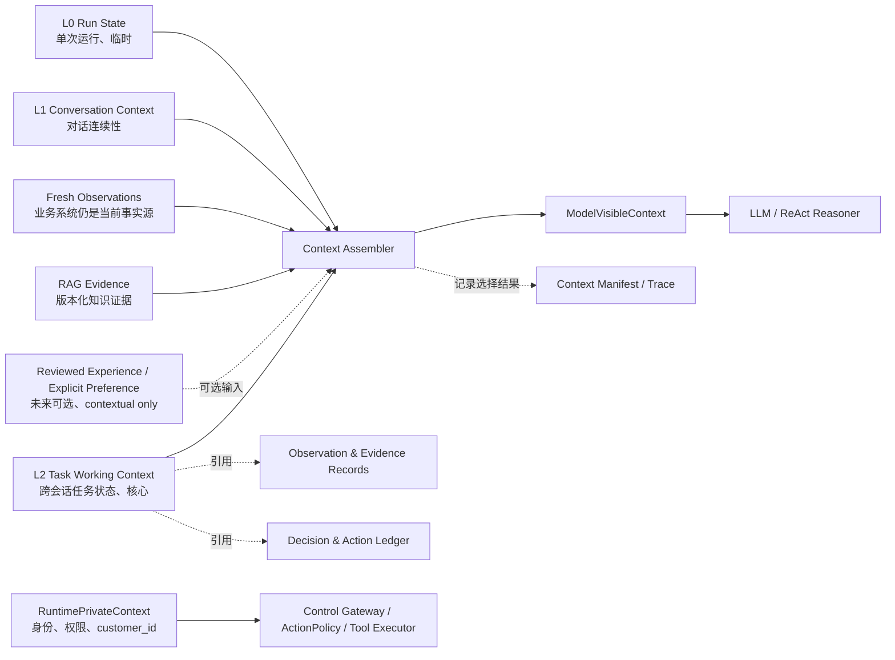

# 消费者订单与配送售后 Agent｜Memory Design Reference

更新日期：2026-07-26  
状态：P0 规范性设计参考  
适用范围：消费者订单、配送异常、退款判断、受控模拟退款执行与结果恢复  
关联基线：[PROJECT_DIRECTION.md](../../PROJECT_DIRECTION.md) 第 3、5、8、9、10 节；Tool 调用机制见 [Tool Calling Design Reference](tool-calling-design-reference.md)；通用评测方法见 [Agent Evaluation Strategy](../evaluation/agent-evaluation-strategy.md)

本文细化当前项目的 Memory、Run / Task State、Observation、Evidence、Action Record 与 Trace 边界。它不把 Memory 设计成一套通用认知系统，而是为 P0 售后 Agent 定义可实现、可恢复、可审计、可评价的状态模型。

文中的“必须”“不得”表示 P0 约束；“可以”“建议”表示允许按实现情况调整。

## 1. 核心结论

当前项目不采用下面这种纵向记忆模型：

```text
短期记忆
  → 长期记忆
  → 向量记忆
```

P0 采用三层运行上下文：

1. `L0 Run State`：单次 Agent Run 的临时控制状态，不属于长期 Memory。
2. `L1 Conversation Context`：维持一次 Conversation 内的语言连续性。
3. `L2 Task Working Context`：跨 Run、跨 Conversation 恢复售后任务的核心状态。

同时保留两个与 Memory 平行、但不可被 Memory 替代的记录域：

1. `Observation & Evidence Records`：记录业务系统观察和 RAG Evidence。
2. `Decision & Action Ledger`：记录决策输入、确认、门禁、幂等、执行和恢复。

`Trace / Context Manifest` 属于平台可观测与 Eval 支撑，不属于 Memory。未来的 `Reviewed Experience` 和 `Explicit Preference` 也是独立的可选上下文源，不是 L2 的后备层。

一句话约束：

> Memory 负责帮助 Agent 继续工作，但不能负责证明事实、授予权限、确认动作或伪造审计真相。

## 2. 从 MOCA 重构中吸收的教训

MOCA 的问题不是简单的“记忆保存得不够多”，而是不同语义被放入了同一个 Memory 抽象。

| 现象 | 根因 | 当前项目的设计决策 |
|---|---|---|
| Session Memory 以 thread 为核心，但业务工作以 case 为核心 | 按时间和聊天线程分层，没有按业务作用域分层 | 核心改为 task-scoped `Task Working Context` |
| 一个 thread 难以表达多个 case，一个 case 也可能跨 thread | Conversation 和业务任务被错误地假设为一对一 | `Conversation : Task = M:N` |
| Long-term / case memory 表存在，但长期没有有效数据 | 没有明确生产者、消费者、失效规则和 Eval | 没有完整闭环的层不进入 P0 |
| AgentState 持有大量原始、标准化、摘要和动作字段 | 运行状态、上下文、业务事实、审计记录边界混乱 | L0、L1、L2、Observation/Evidence、Ledger 分开 |
| 活跃 case 状态和历史 case precedent 名称相近 | 当前工作上下文和历史经验被误认为可以互相回退 | 活跃 Task 与 Reviewed Experience 永不互相 fallback |
| 业务事实、Evidence、审批、Trace 被称为 Memory | 上下文被误认为权威来源 | 每类数据必须声明 authority 与 visibility |
| 为缓存、向量检索和长期记忆提前建设基础设施 | 先建设存储，后寻找真实需求 | P0 使用确定性查询和单一持久化权威，测量后再扩展 |

因此，本设计的第一分层轴不是“保存多久”，而是：

1. 数据属于哪个业务作用域。
2. 数据对什么事情具有权威性。
3. 数据如何产生、修正、失效和删除。
4. 数据是否允许进入模型上下文。

## 3. 四个强制分类维度

每类持久化记录都必须明确以下维度，不能只依靠表名推断语义。

### 3.1 Scope

| Scope | 含义 |
|---|---|
| `RUN` | 一次模型推理与工具循环 |
| `CONVERSATION` | 一次用户对话 |
| `TASK` | 一个可恢复的售后目标链 |
| `CUSTOMER` | 当前登录消费者；只允许私有作用域使用 |
| `GLOBAL_KNOWLEDGE` | 版本化退款政策语料 |

P0 不引入 tenant、merchant、team 等多租户作用域。

### 3.2 Authority

| Authority Class | 含义 | 例子 |
|---|---|---|
| `TRUSTED_PRIVATE` | 来自认证或服务端注入，只供 Runtime 私有组件使用 | `customer_id`、授权范围 |
| `BUSINESS_OBSERVATION` | 通过受控工具从业务系统观察到的标准化结果 | 订单状态、物流状态、退款状态 |
| `VERSIONED_EVIDENCE` | 可追溯、可引用、有适用范围的知识证据 | 退款政策片段和版本 |
| `DETERMINISTIC_DERIVATION` | 确定性代码根据已知输入计算的结果 | 退款资格判断 |
| `USER_CLAIM` | 用户陈述，只能作为待验证输入 | “包裹五天没更新” |
| `MODEL_INFERENCE` | 模型推断或摘要，只能作为候选和上下文 | 目标候选、Conversation 摘要 |
| `CONTEXTUAL_ONLY` | 只用于辅助解释或相似性参考 | 已审核历史先例 |

### 3.3 Lifecycle

| Lifecycle | 含义 |
|---|---|
| `EPHEMERAL` | Run 结束即可清理 |
| `CHECKPOINTED` | 为崩溃恢复而短期保存 |
| `CURRENT_PROJECTION` | 当前 Task 或 Conversation 的可变投影 |
| `VERSIONED_RECORD` | 不覆盖历史，以新版本或纠正记录取代旧版本 |
| `REVIEWED` | 经过人工审核后才能供后续任务使用 |

### 3.4 Visibility

| Visibility | 含义 |
|---|---|
| `RUNTIME_PRIVATE` | 不得进入 Prompt、模型 Memory 或普通 Trace |
| `MODEL_VISIBLE` | 经过最小化、脱敏和白名单投影后可进入模型 |
| `AUDIT_ONLY` | 只用于审计、回放或 Eval，不进入普通 Prompt |
| `USER_VISIBLE` | 可以通过安全回复向当前用户披露 |

私有资源未通过归属校验时，其真实 payload 不能进入上述普通记录流。实现如因安全调查确需保留，只能写入与模型、Memory、标准 Observation、Context Manifest 和普通 Trace 隔离的受限诊断域，并受独立访问与保留策略控制。

## 4. 总体结构



这些组件不是一条逐层回退链：

- L1 找不到业务事实时，不能用 Conversation 摘要补齐。
- L2 中的旧 Observation 过期时，必须重新调用业务工具，不能用历史先例替代。
- 当前政策 Evidence 缺失时，不能用过去案例证明当前退款资格。
- Action Ledger 找不到有效确认时，不能从聊天摘要推断用户已经确认。

## 5. 什么属于 Memory，什么不属于

| 数据 | 所属域 | 是否属于 Memory | 对什么具有权威性 |
|---|---|---:|---|
| 当前 step、预算、重试和停止状态 | L0 Run State | 否，属于运行状态 | 当前 Run 的执行控制 |
| 最近消息和对话投影 | L1 Conversation Context | 是 | 用户和系统说过什么 |
| RequestUnit 与任务推进状态 | L2 Task Working Context | 是 | Task 工作流状态 |
| `customer_id`、认证主体、授权范围 | RuntimePrivateContext | 否 | 当前身份与授权 |
| 订单、物流、退款当前状态 | Business System / Observation | 否 | 外部业务系统是当前事实源 |
| 退款政策 | Policy Knowledge Base / Evidence | 否 | 指定版本与适用范围内的知识证据 |
| 待确认退款方案、确认、幂等和执行结果 | Decision & Action Ledger | 否 | 动作生命周期和审计 |
| 已通过归属边界的原始 ToolResult | Raw Observation Record / 受限诊断域 | 否 | 某次工具调用返回了什么 |
| Trace 与 Context Manifest | Trace Store | 否 | 系统当时做了什么、看到了什么 |
| 历史成功案例 | Reviewed Experience | 否 | 只提供 contextual reference |
| 用户明确要求记住的软偏好 | Explicit Preference | 独立可选域 | 只对非安全偏好有效 |

## 6. L0 Run State

### 6.1 作用域

`L0 Run State` 只属于一次 `AgentRun`，不能作为跨任务的长期记忆。

### 6.2 保存内容

```text
run_id
conversation_id
current_step
budget
attempt_count
current_next_move
in_flight_tool_call_ref?
transient_observation_refs[]
stop_reason?
checkpoint_version
started_at
updated_at
```

可以包含：

- 当前受控 ReAct 进行到哪一步。
- 步数、Token、时间和工具预算。
- 当前 `NextMove`。
- 工具超时或重试所需的临时引用。
- 当前 Run 的停止、失败和恢复状态。

不得包含：

- 可跨 Conversation 复用的任务权威状态。
- 用户身份或 Token 原文。
- 作为当前业务事实长期使用的 ToolResult 副本。
- 从模型推理中自动产生的长期偏好。

### 6.3 持久化

- 正常 Run 可以只保留必要 checkpoint。
- 发生进程崩溃、工具超时或流式响应中断时，可以从 checkpoint 恢复。
- Run 完成后，L0 可以压缩或按运行保留策略清理。
- L0 被持久化不等于它升级为长期 Memory。

## 7. L1 Conversation Context

### 7.1 目标

L1 只解决 Conversation 内的语言连续性：

- 用户说“第二个”“那个包裹”时知道他在指什么。
- Runtime 知道上一轮向用户询问了什么。
- 本轮 Request Understanding 能看到必要的最近对话。

L1 不负责业务任务恢复，也不负责证明事实。

### 7.2 建议契约

```text
ConversationContextProjection
  conversation_id
  recent_message_refs[]
  pending_question_ref?
  unresolved_mention_refs[]
  linked_task_ids[]
  optional_summary?
  summary_source_message_refs[]
  projection_version
  projected_at
  expires_at?
```

消息原文应保存在 Conversation Store。L1 是本轮选择出来的投影，不必复制完整聊天记录。

### 7.3 摘要规则

Conversation 摘要如果启用，必须：

1. 标记为 `MODEL_INFERENCE`。
2. 保留来源消息范围。
3. 可以被重新生成或完全丢弃。
4. 不得生成新的订单号、金额、状态、确认或政策结论。
5. 不得把用户陈述升级成 `BUSINESS_OBSERVATION`。
6. 不得成为退款动作确认的唯一证据。

P0 可以先使用最近消息、待回答问题和精确引用，不实现滚动摘要。只有 Context Token Eval 表明确有需要时再增加。

### 7.4 生命周期

- Conversation 关闭不等于 Task 关闭。
- Conversation 可以清理或压缩，但关联的 Task 可以继续存在。
- L1 的保留周期不能控制 Action Ledger 或 Task State 的保留周期。

## 8. L2 Task Working Context

### 8.1 Task 的定义

Task 是一个可恢复的售后业务目标链，不等于：

- 一次用户消息。
- 一次模型推理。
- 一个 Conversation。
- 一个工具调用。
- 一个单独 Intent 标签。

示例：

```text
针对订单 O-1001 调查配送异常；
如果退款政策允许，则生成退款方案；
用户确认后执行退款并恢复最终结果。
```

这可以是一个 Task，内部包含相互依赖的多个 RequestUnit：

```text
RU-1 查询关联包裹的当前状态，并解释是否异常
RU-2 若当前事实与政策判定符合条件，则在精确确认后创建模拟退款
```

订单定位、ToolCall、配送异常或退款资格的确定性判断、政策检索、动作门禁和结果恢复属于目标内部推进，不额外建立 RequestUnit。Request Understanding 的 Goal Delta 与 RequestUnit 粒度以 [Intent / Request Understanding Design Reference](intent-design-reference.md) 为准。

如果一条消息中包含彼此独立的目标，例如查询两个无关订单，则应建立两个 Task 或两个可独立推进的 Task 分支，而不是把全部状态混在同一个 Conversation Memory 中。

### 8.2 L2 是现有 Task State 的规范化视图

`Task Working Context` 不要求再创建一套与 `RequestUnit Board` 重复的领域模型。

推荐解释：

```text
Task Working Context
  = Task State
  + RequestUnit Board
  + 当前目标绑定
  + Observation / Evidence / Action 引用
  + 恢复所需的最小投影
```

具体实现可以是一个 Task 聚合、若干关系表和一个物化投影，不要求存在名为 `task_working_context` 的单表。

### 8.3 建议契约

```text
TaskWorkingContext
  task_id
  private_owner_scope
  status
  request_unit_refs[]
  target_refs[]
  open_questions[]
  observation_refs[]
  evidence_bindings[]
  pending_action_ref?
  last_outcome_ref?
  state_version
  created_at
  updated_at
```

字段说明：

- `private_owner_scope`：包含用于数据库隔离的 `customer_id`，只允许 Runtime 私有组件读取，不进入 Prompt。
- `request_unit_refs`：指向 Runtime 已校验的 RequestUnit，不保存未经校验的模型候选。
- `target_refs`：经过归属验证的订单、商品、物流或退款引用。
- `open_questions`：聚合当前各 RequestUnit 为安全推进真正缺少的信息，不是固定 Intent Slot 表。
- `observation_refs`：指向标准化 Observation；可以带最小当前投影，但不能冒充外部事实源。
- `evidence_bindings`：指向某个判断所使用的 Evidence、版本、适用范围和新鲜度。
- `pending_action_ref`：指向 Action Ledger 中尚待确认或执行的精确方案。
- `last_outcome_ref`：指向最近一次完成、失败或未知结果记录。
- `state_version`：用于并发控制、恢复和确认失效判断。

### 8.4 Task 状态

P0 可以采用以下最小状态集合；具体命名可在实现时调整：

```text
ACTIVE
WAITING_USER
PENDING_ACTION
ACTION_IN_PROGRESS
RECOVERING
COMPLETED
BLOCKED
CANCELLED
```

状态迁移必须由程序控制。模型只能提出候选 `NextMove`，不能直接把 Task 标记为完成、已确认或已退款。

### 8.5 权威边界

L2 对以下内容具有权威性：

- 当前 Task 包含哪些经过验证的 RequestUnit。
- RequestUnit 当前处于什么执行状态。
- 当前有哪些等待补充的开放问题。
- 当前绑定了哪些目标引用。
- 当前使用了哪些 Observation、Evidence 和 Action Record。
- Task 是否正在等待用户、执行、恢复或已经结束。

L2 对以下内容不具有最终权威性：

- 用户当前是否仍然有权访问某个订单。
- 订单、物流、退款的最新状态。
- 当前政策正文和适用版本。
- 用户是否确认了一个参数已经变化的退款方案。
- 副作用是否真实发生。

这些内容必须在需要时回到对应权威源复核。

## 9. Observation 与 Evidence

### 9.1 Claim、Observation、Evidence 必须分开

| 类型 | 来源 | 是否可以直接作为业务事实 |
|---|---|---:|
| User Claim | 用户消息 | 否 |
| Model Inference | Request Understanding、摘要、Reasoner | 否 |
| Tool Observation | 经过注册工具、业务 API 归属校验和标准化后的结果 | 可以作为某个时间点的已验证观察 |
| RAG Evidence | 版本化语料检索结果 | 可以证明对应知识内容，但不能证明当前订单状态 |
| Deterministic Derivation | 规则代码 | 只对明确输入和规则版本有效 |
| Reviewed Precedent | 历史案例 | 否，只能辅助参考 |

用户说“包裹五天没更新”时：

1. L1 保存这句话的消息引用。
2. Request Understanding 可以生成配送异常调查候选。
3. Runtime 调用 `get_shipment`。
4. 标准化 ToolResult 形成 `ShipmentObservation`。
5. 确定性诊断依据 Observation 判断是否停滞。

不得在第 1 或第 2 步把用户陈述直接升级为 verified fact。

### 9.2 Observation 建议字段

```text
observation_id
source_tool
source_resource_ref
source_version?
normalized_type
normalized_value
observed_at
recorded_at
valid_until?
supersedes?
raw_result_ref?
visibility
```

时间必须分开：

- `observed_at`：业务事实在什么时候被观察到。
- `recorded_at`：本系统在什么时候写入记录。
- `valid_until`：什么时候必须重新获取。

原始 ToolResult 可以保留在独立记录中用于诊断，但进入 Prompt 的只能是标准化、最小化和脱敏后的投影。

对订单、物流、退款和历史任务等私有资源，只有已确认属于当前用户的数据才能形成标准 Observation。`NOT_FOUND`、`NOT_OWNED` 或 `OWNERSHIP_UNVERIFIED` 等内部结果必须先折叠为 `NOT_FOUND_OR_NOT_ACCESSIBLE`，不创建含资源内容的 Observation，也不让 Context Manifest 或后续模型调用引用真实差异。

### 9.3 Evidence Binding 建议字段

```text
evidence_binding_id
task_id
request_unit_id
purpose
document_ref
document_version
section_ref
applicability
retrieved_at
valid_until?
conflict_status
citation
```

Evidence 必须绑定使用目的。例如同一政策片段可以用于解释，但不一定足够支持退款执行。

RAG Retriever 负责找知识；Evidence Assembler 负责版本、冲突、适用范围和引用；TaskWorkingContext 只保存绑定引用。Policy Corpus 受控 ingestion、清洗、结构解析、Chunking、Hybrid Retrieval、RRF、Cross-Encoder 和 Evidence 组装处理的内部契约见 [RAG Design Reference](rag-design-reference.md)；本文继续拥有 Evidence Binding 的权威字段、生命周期与引用语义。

## 10. Decision & Action Ledger

### 10.1 为什么不能放进 Memory

待确认动作、用户确认、退款调用和未知结果恢复具有安全与审计语义。它们不能依靠：

- Conversation 摘要。
- 模型自行回忆。
- L2 中一个布尔字段。
- “用户刚才好像同意了”的自然语言推断。

因此必须使用独立、结构化、可追加的 Ledger。

### 10.2 建议记录

```text
DecisionActionRecord
  record_id
  task_id
  request_unit_id
  run_id
  action_type
  proposal_payload
  proposal_hash
  input_observation_refs[]
  evidence_binding_refs[]
  policy_or_rule_version
  gate_decisions[]
  confirmation_message_ref?
  confirmation_hash?
  idempotency_key?
  attempt_no
  execution_status
  external_result_ref?
  observed_at
  recorded_at
```

`execution_status` 至少能表达：

```text
PROPOSED
AWAITING_CONFIRMATION
CONFIRMED
STARTED
COMPLETED
FAILED
RESULT_UNKNOWN
RECONCILED
INVALIDATED
```

### 10.3 精确确认绑定

用户确认必须绑定到同一个精确方案：

```text
proposal_hash = hash(
  action_type,
  resource_refs,
  quantity,
  amount,
  refund_method,
  user_visible_impact,
  critical_observation_versions,
  evidence_versions
)
```

以下任一项变化，原确认必须失效：

- 订单或商品。
- 数量。
- 金额。
- 退款方式。
- 用户可见影响。
- 关键 Observation。
- Evidence 或政策版本。
- 当前授权范围。

L2 只保存 `pending_action_ref`，不能复制一个脱离 Ledger 的“已确认”标志。

## 11. Conversation、Task、RequestUnit 与 Run 的关系

推荐关系：

```text
Customer      1:N Conversation
Customer      1:N Task
Conversation  M:N Task
Task          1:N RequestUnit
Task          1:N ObservationBinding
Task          1:N EvidenceBinding
Task          1:N DecisionActionRecord
Conversation  1:N AgentRun
AgentRun      M:N Task
```

### 11.1 Conversation 与 Task 必须多对多

原因：

- 一个 Conversation 可以同时讨论多个订单和多个独立目标。
- 一个 Task 可以在另一个 Conversation 中继续。
- 一次 Run 可以从一条多意图消息更新多个 Task。
- Conversation 的关闭、归档或压缩不能隐式关闭 Task。

建议关系记录：

```text
ConversationTaskLink
  conversation_id
  task_id
  link_reason
  linked_at
  last_active_at
  status
```

即使 P0 UI 一次只突出显示一个活动 Task，存储模型也不得假设 `conversation.task_id` 是唯一外键。

### 11.2 身份隔离

Task、Conversation、Observation、Action Record 的加载必须在服务端使用当前可信 `customer_id` 限定：

```text
(customer_id, task_id)
(customer_id, conversation_id)
(customer_id, order_id)
(customer_id, refund_id)
```

模型不得生成或覆盖 `customer_id`。未经当前 Run 重新授权和归属复核，历史 Task 不能直接解锁私有资源或副作用。

## 12. 写入路径

### 12.1 总原则

模型和工具都不能直接写 Memory。

```text
LLM 产生候选
  → Runtime 结构校验
  → 服务端权限与作用域校验
  → 私有资源归属结果归一化
  → 标准化事件或命令
  → 确定性 Reducer 更新 Task State
```

工具只返回标准化 ToolResult；Runtime 判断它是否形成 Observation、绑定到哪个 Task，以及哪些字段允许进入模型。

### 12.2 建议事件

```text
MessageAccepted
TaskDeltasValidated
TaskLinkedToConversation
TargetResolved
ObservationRecorded
EvidenceBound
UserCorrectionAccepted
ActionProposed
ActionConfirmationRecorded
ActionInvalidated
ActionStarted
ActionCompleted
ActionFailed
ActionResultUnknown
ActionReconciled
TaskCompleted
TaskBlocked
```

不要求实现完整 Event Sourcing。最低要求是：

- 当前 Task 状态有版本控制。
- 关键动作记录 append-only。
- 能知道某个状态由什么输入和记录产生。
- 纠正通过新记录 supersede 旧记录，不静默篡改审计历史。

### 12.3 写入可靠性

| 写入 | 可靠性要求 |
|---|---|
| Conversation 原始消息 | 必须可靠保存 |
| Task / RequestUnit 状态迁移 | 必须可靠、带版本控制 |
| Observation / Evidence 绑定 | 关键决策前必须成功 |
| 退款方案与确认 | 必须先持久化再允许执行 |
| Action Attempt / Result | 必须与幂等和恢复身份关联 |
| Conversation 摘要 | 可以异步、失败可重建 |
| Trace 扩展字段 | 可以按可观测策略降级，但不能伪造成功 |

副作用执行附近应使用事务、唯一约束、幂等键或 Outbox 等机制保证：

- 不因响应失败丢失已开始的动作记录。
- 不因进程重启重复创建退款。
- `RESULT_UNKNOWN` 可以使用原身份对账。

## 13. 读取与 Context Assembly

### 13.1 两阶段加载

为了支持指代解析、多意图和跨会话恢复，又避免把所有历史塞进 Prompt，建议采用两阶段加载。

第一阶段，用于 Request Understanding：

```text
当前用户消息
+ 最近 Conversation 投影
+ 当前 Conversation 关联的活动 Task 索引
+ 当前可信但最小化的运行约束
```

活动 Task 索引只包含：

- `task_id` 的模型安全别名。
- 用户可识别的最小目标摘要。
- 当前状态。
- 已脱敏目标标签。

第二阶段，在 `TaskDeltaCandidate` 经过校验、Reducer 写入 RequestUnit 并完成 Task 绑定后：

```text
精确加载目标 TaskWorkingContext
+ 刷新需要的新鲜 Observation
+ 检索并绑定所需 Evidence
+ 加载相关 Pending Action 引用
+ 组装本轮 ModelVisibleContext
```

不得在第一阶段对当前用户的全部历史 Task 做无界向量搜索。

### 13.2 Context 优先级

Context Assembler 推荐按以下优先级处理冲突：

1. Runtime 私有安全约束和服务端授权。
2. 当前用户消息。
3. 当前 Task 与 RequestUnit 状态。
4. 新鲜的标准化 Observation。
5. 当前适用的版本化 Evidence。
6. Pending Action 的用户可见投影。
7. 最近 Conversation 消息。
8. Conversation 摘要。
9. 已审核历史经验或明确偏好。

低优先级内容不得覆盖高优先级内容。Runtime 私有字段只影响控制和投影，不直接进入模型。

### 13.3 Context Manifest

每次模型调用应生成一个可审计的 Context Manifest：

```text
context_manifest_id
run_id
model_call_id
tool_registry_version
model_visible_toolset_hash
selected_message_refs[]
task_state_ref_and_version?
observation_refs_and_versions[]
evidence_refs_and_versions[]
action_record_refs[]
redaction_policy_version
truncation_decisions[]
token_counts
assembled_at
```

Context Manifest 记录“模型实际看到了哪些输入”，用于：

- 重放。
- Eval。
- 调试错误 Task 绑定。
- 检查过期事实。
- 分析 Token 成本。

其中：

- `tool_registry_version` 标识本次模型调用使用的完整 Runtime 工具注册配置版本。
- `model_visible_toolset_hash` 标识经过 Provider 名称与 Schema 适配后，模型实际看到的 ToolSpec 集合；它必须能解析到不可变的安全 Toolset Artifact。
- `task_state_ref_and_version` 只有在模型调用实际加载了既有目标 Task 时才存在。当前消息尚未绑定既有 Task 的首次 Request Understanding 调用可以为空；Reducer 创建 Task 后，后续 Gate、Trace 和模型调用必须引用真实的 Task state version，不得使用伪造的 `0` 版本。
- Tool Calling 系统负责生成、冻结和校验工具集；Context Manifest 负责保存本次模型调用对该工具集的引用。具体 Hash、Artifact 和同快照校验规则以 [Tool Calling Design Reference](tool-calling-design-reference.md) 为准。
- Context Manifest 不保存 Handler、Provider 密钥、可信 `customer_id`、授权范围或其他 Runtime 私有注册内容。

它不得保存模型隐藏思维链，也不得成为业务事实权威源。

## 14. 新鲜度、纠正与失效

### 14.1 新鲜度

不同数据应有不同的新鲜度策略：

| 数据 | 建议策略 |
|---|---|
| 订单商品静态信息 | 源版本变化时刷新 |
| 订单状态 | 进入依赖该状态的判断或动作前刷新 |
| 物流状态 | 配送异常诊断和退款判断前按 TTL 刷新 |
| 退款状态 | 查询、恢复和重复检查前刷新 |
| 政策 Evidence | 检查版本、适用范围、有效期和冲突 |
| 用户消息 | 不过期，但后续消息可以纠正 |
| 模型摘要 | 随 Conversation 投影重建 |
| Pending Action | 任一绑定输入变化即失效 |

跨会话恢复时，默认恢复的是 Task 结构和引用，不是无条件相信旧事实。

### 14.2 用户纠正

用户说“不是第二个，是第一个订单”时：

1. 保存新的用户消息。
2. 记录一个纠正候选。
3. Runtime 重新执行目标解析和归属校验。
4. 更新 Task 目标绑定并增加 `state_version`。
5. 将依赖旧目标的派生判断、Evidence Binding 和 Pending Action 标记为失效。

用户纠正不能直接覆盖业务 API 返回的当前事实。如果用户和业务系统冲突，应保留 claim 与 observation 两条记录，并根据场景重新查询或询问。

### 14.3 并发与版本

- Task 更新应使用 optimistic locking、CAS 或等效版本检查。
- 旧 Run 不得覆盖新 Run 已更新的 Task。
- 确认必须引用对应的 `task_state_version` 和 `proposal_hash`。
- 对同一个幂等动作，只允许一个有效执行身份。

## 15. 存储与检索策略

### 15.1 P0 存储

P0 使用一个持久化关系数据库作为以下数据的权威存储：

- Conversation 和 Message。
- Run checkpoint。
- Task 和 RequestUnit。
- ConversationTaskLink。
- Observation / Evidence Binding。
- Decision & Action Ledger。
- Trace / Context Manifest。

Memory 领域契约不能依赖某个数据库特性。当前 P0 实现 profile 已在 [PROJECT_DIRECTION.md](../../PROJECT_DIRECTION.md) 中裁决为从第一条可执行订单切片开始统一使用 `PostgreSQL + pgvector + tsvector`，本地开发与测试通过 Docker Compose 启动，不保留 SQLite 过渡基线；该选择只约束当前基础设施实现，不改变本节的记录语义、Port 所有权、事务义务或可见性边界。具体 Compose、迁移与 RAG 激活要求分别服从 [E2E-01 Thin Slice Implementation Spec](../implementation/e2e01-thin-slice-implementation-spec.md) 和 [RAG Design Reference](rag-design-reference.md)。

### 15.2 Redis

P0 不使用 Redis 作为任何 Memory、Task、确认或动作结果的权威源。

未来只有在测量证明有必要时，Redis 才可以用于：

- 缓存。
- 分布式锁。
- 限流。
- 短期流式连接状态。

缓存丢失不得改变任务真相或导致动作重复。

### 15.3 向量检索

P0 不需要向量数据库管理活动 Task。

| 目标 | 检索方式 |
|---|---|
| 当前 Conversation | 精确 `conversation_id` |
| 活动 Task | `(customer_id, task_id)`、状态和关联表 |
| 订单、物流、退款目标 | 经过授权的业务引用和确定性查询 |
| Pending Action | `task_id + proposal_hash` |
| 退款政策 | RAG Retriever |
| 未来 Reviewed Experience | 先 metadata filter，Eval 证明需要后再增加向量召回 |

活动任务不能仅通过语义相似度自动绑定。多个候选时必须询问用户。

## 16. 模块所有权

| 模块 | Memory 相关职责 |
|---|---|
| `ConversationService` | Conversation 生命周期、消息保存、L1 选择 |
| `AgentRunCoordinator` | 绑定 CustomerContext，加载 Run / Task，协调事务 |
| `Request Understanding` | 只产生 Query 上下文化与 `TaskDeltaCandidate`，不直接写状态 |
| `TaskDelta Validator / RequestUnit Board / Task Reducer` | 校验候选、写入薄 RequestUnit、推进 Task、维护版本 |
| `Model Context Projector / Context Assembler` | 最小化、脱敏、排序和组装模型上下文 |
| `Tool Registry & Executor` | 冻结模型可见工具集，执行已通过 Gate 的注册工具，服务端注入可信参数；调用生命周期以 Tool Calling Design Reference 为准 |
| `Observation Normalizer` | 把 ToolResult 转为标准化 Observation |
| `Evidence Assembler` | 维护 Evidence 版本、适用范围、冲突和引用 |
| `Control Gateway` | 校验 NextMove、预算、重复调用和停止条件 |
| `ActionPolicy` | 基于当前权威输入检查确认、权限、Evidence 和幂等 |
| `Infrastructure Stores` | 持久化实现，不定义领域语义 |
| `Trace / Eval` | 记录 Context Manifest、结果和评价数据 |

不建议建立一个包含所有读写逻辑的 `MemoryService` 或 `memory/` 巨型模块。模块名称应反映真实语义，例如：

```text
conversation
task_state
context_projection
observations
evidence
action_ledger
trace
```

## 17. P0 必须实现与明确延后

### 17.1 P0 必须实现

- L0 Run checkpoint 与失败恢复。
- L1 最近消息选择和 Conversation 投影。
- L2 Task / RequestUnit 的持久化状态。
- Conversation 与 Task 多对多关联。
- Claim、Observation、Evidence 分离。
- Observation 的来源、时间和新鲜度。
- Evidence Binding 的版本、适用范围和引用。
- Pending Action 的精确方案与确认绑定。
- Action Ledger、幂等和 `RESULT_UNKNOWN` 恢复。
- 包含工具注册版本与模型可见 Toolset Hash 的 Context Manifest。
- CustomerContext 私有边界与跨用户隔离。
- 私有资源归属失败在 Observation、Memory、Context Manifest 和普通 Trace 之前统一安全归一化。
- Task 版本控制、纠正和确认失效。

### 17.2 P0 明确不实现

- 通用长期记忆。
- 自动用户画像。
- 自动提炼用户偏好。
- 模型自由读写的 Memory Tool。
- 活动 Task 的向量检索。
- 未审核的跨任务经验自动复用。
- “从所有历史中自主寻找经验”的 Agent。
- Redis 权威状态。
- 独立 Memory 微服务。
- 完整 Event Sourcing 平台。

### 17.3 未来可选

#### Reviewed Experience

只有 Task 结束后才可以生成候选：

```text
Closed Task
  → Experience Candidate
  → Human Review
  → Searchable Reviewed Experience
```

要求：

- 默认只读。
- `CONTEXTUAL_ONLY`。
- 先使用 metadata 检索。
- 不证明当前事实、政策、授权或确认。
- 不作为 L2 找不到状态时的 fallback。

#### Explicit Preference

只允许保存用户明确表达并允许修改、查看、删除的软偏好，例如回复语言或解释详细程度。

不得保存或推断：

- 安全规则例外。
- 自动退款授权。
- 身份与权限。
- 未经用户确认的敏感画像。
- 从普通售后聊天自动总结的长期性格或消费能力判断。

## 18. Eval 与验收

Memory 设计必须通过行为 Eval，而不是以“数据库有几张表”作为完成标准。

本节拥有 Memory、Task State、Observation / Evidence 引用、Action Ledger 和 Context Manifest 的专项行为 obligations；通用 EvalCase、Dataset 生命周期、Grader、Critical failure、Gate 与跨组件覆盖服从 [Agent Evaluation Strategy](../evaluation/agent-evaluation-strategy.md) 和 [P0 Eval Coverage Matrix](../evaluation/p0-eval-coverage-matrix.md)。场景只有在可复现 Harness 中运行后才能从 `CONTRACT_DEFINED` 进入 `EXECUTABLE`。

| Eval 场景 | 预期结果 |
|---|---|
| 同一 Conversation 中说“第二个订单” | 只使用当前用户候选，正确解析或 `ASK_USER` |
| 同一 Conversation 同时讨论两个无关订单 | 建立并隔离两个 Task，不串联 Observation 和结果 |
| 在新 Conversation 继续旧退款 | 在当前身份范围内精确恢复 Task；多候选时询问 |
| 用户纠正订单目标 | 新版本覆盖工作投影，依赖旧目标的确认失效 |
| 旧物流状态已经过期 | 执行判断或动作前重新查询 |
| 政策版本变化 | 旧 Evidence Binding 和退款方案重新评估 |
| 用户曾说“可以退款” | 不把用户陈述当政策 Evidence 或动作确认 |
| 未授权订单号出现在消息中 | 消息引用可以保留用户原话，但任何真实资源内容不进入 ModelVisibleContext、Memory、标准 Observation 或普通 Trace |
| 订单、物流、退款或历史任务不存在、非本人或无法确认归属 | 统一安全 outcome；不持久化含资源内容的普通 Observation，不让后续模型看到真实差异 |
| `create_refund` 返回 `RESULT_UNKNOWN` | 使用原幂等身份查询恢复，不重复创建 |
| 使用历史 Context Manifest 重放模型调用 | 能通过 `model_visible_toolset_hash` 解析当时完整的 Provider-visible ToolSpec，且不暴露 Runtime 私有注册信息 |
| Conversation 摘要丢失 | Task 正确性和动作安全不受影响 |
| 历史先例与当前政策冲突 | 当前政策优先，先例只能作为背景 |
| 两个 Run 并发更新同一 Task | 旧版本写入失败，不覆盖新状态 |

建议持续跟踪：

```text
wrong_task_binding_rate
cross_customer_leakage_rate
stale_observation_action_rate
claim_promoted_to_fact_rate
confirmation_invalidation_accuracy
task_recovery_success_rate
result_unknown_reconciliation_rate
context_token_count
context_relevance_precision
ledger_completeness
```

其中以下指标 P0 目标必须为零：

- 跨用户数据泄露。
- 使用失效确认执行退款。
- `RESULT_UNKNOWN` 后重复创建退款。
- 用户或模型陈述被静默升级为业务事实。

## 19. 新 Memory 能力的准入检查

以后增加任何所谓“Memory 层”之前，必须回答：

1. 谁产生它？
2. 谁读取它？
3. 它帮助完成哪个用户目标？
4. 它对什么具有权威性？
5. 它什么时候失效？
6. 用户或系统如何纠正和删除它？
7. 它是否允许进入模型？
8. 没有它时系统会出现什么可测量的问题？
9. 用什么 Eval 证明它比现有确定性检索更好？

任何一个问题没有明确答案，都不应进入 P0。

## 20. 与旧架构术语的映射

`PROJECT_DIRECTION.md` 已在 2026-07-25 同步采用本节规范术语。以下映射用于解释仍可能出现在历史文档或待修订图形中的旧表达：

| 旧术语 | 本文规范术语 |
|---|---|
| `L0 Run State` | 保留，但明确它是运行状态，不是长期 Memory |
| `L1 Conversation Context` | 保留，强调它只是本轮 Conversation 投影 |
| `L2 Task Memory` | 改称 `L2 Task Working Context` 或 `Durable Task State` |
| 可信事实 | 改为带来源、版本和时间的 `ObservationRef` |
| Evidence | 保存在 Evidence 域，L2 只保存 `EvidenceBinding` |
| 待确认动作 | 保存在 Action Ledger，L2 只保存 `pending_action_ref` |
| 执行结果 | 保存在业务系统与 Action Ledger，L2 只保存结果引用和任务投影 |
| Trace | 独立的可观测与 Eval 记录，不参与事实 fallback |

“由 Runtime 管理”只说明业务责任属于 Agent Runtime，不意味着这些数据必须放在同一个对象、同一张表或同一个 Memory 模块中。

## 21. 最终设计原则

1. Scope-first：先确定 Run、Conversation、Task、Customer 或 Knowledge 作用域。
2. Authority-first：先确定谁能证明什么，再决定是否保存到上下文。
3. Task-centered：跨会话恢复围绕 Task，而不是围绕聊天摘要。
4. Reference-over-copy：L2 优先保存 Observation、Evidence 和 Action 引用，而不是复制权威内容。
5. Deterministic writes：LLM 产生候选，程序校验和更新状态。
6. Fresh-before-action：动作前重新检查授权、事实、Evidence、确认和幂等。
7. No implicit promotion：用户陈述、模型摘要和历史经验不得自动升级为事实。
8. No fallback across authorities：Conversation、Task、Evidence、Ledger 和 Experience 不互相冒充。
9. Minimal model context：只向模型投影当前目标所需的最小数据。
10. Eval before expansion：没有可测量价值的长期记忆、向量检索和缓存不建设。
