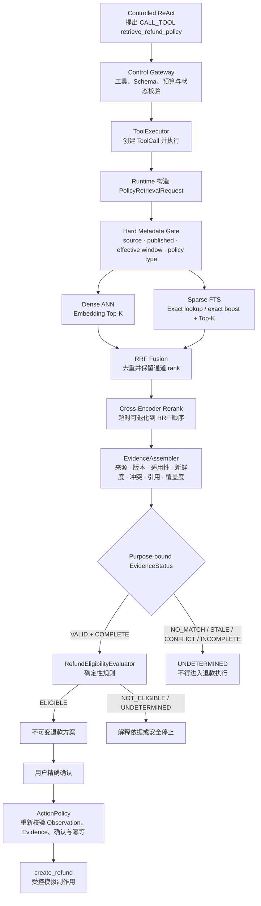

# 消费者订单与配送售后 Agent｜RAG Design Reference

更新日期：2026-07-25  
状态：P0 规范性设计参考  
适用范围：退款政策 Corpus、`retrieve_refund_policy` 内部检索链路、Evidence 组装、RAG Trace 与 Eval  
关联基线：[PROJECT_DIRECTION.md](../../PROJECT_DIRECTION.md) 第 2、5、6、10、11 节；Evidence 记录语义见 [Memory Design Reference](memory-design-reference.md)；工具执行语义见 [Tool Calling Design Reference](tool-calling-design-reference.md)

> 本文定义 P0 目标契约，不表示仓库中已经存在可运行的 Corpus、Embedding、向量索引、FTS、RRF、Cross-Encoder、EvidenceAssembler、测试或评测结果。

本文收敛当前项目关于售后 RAG 的讨论。P0 既不退化为“只做关键词检索”，也不把 RAG 扩展为知识图谱、自治检索 Agent 或多套搜索基础设施。正常检索路径必须展示 `Embedding Dense Retrieval + Sparse FTS + RRF + Cross-Encoder Rerank`，同时由确定性代码控制政策有效性、Evidence 状态、退款资格和 Action 安全边界。

文中的“必须”“不得”表示 P0 约束；“建议”表示初始实现选择；`OPEN` 表示必须由 Dataset、Eval 或后续技术栈裁决，不能提前宣称已经验证。

## 1. 文档所有权与适用边界

本文是 P0 RAG 内部设计 owner，负责回答：

- Policy Corpus 如何从受控源文档经过清洗、结构解析和 Chunking 进入 P0，以及检索单元携带哪些元数据。
- `PolicyRetrievalRequest` 如何由 Runtime 内部构造。
- Hard Gate、Dense、Sparse、RRF、Cross-Encoder 如何分工。
- Exact Term 如何作为确定性 lookup 或 Sparse boost，而不是第三套 Retriever。
- EvidenceAssembler 如何消费候选并形成 purpose-bound Evidence。
- ToolCall 执行状态、Evidence 质量状态和覆盖度如何分开。
- RAG 需要记录哪些 Trace，并通过哪些 Component、Trajectory 和 E2E Eval 验证。
- P0 哪些能力必须实现，哪些明确延期。

本文不重新拥有以下语义：

| 范围 | Canonical owner |
|---|---|
| P0 用户目标、两条 E2E、Tool Catalog、Mock 系统和业务验收 | [`docs/business-capabilities.md`](../business-capabilities.md) |
| Runtime 主干、Controlled ReAct 和 ActionPolicy 上位方向 | [`PROJECT_DIRECTION.md`](../../PROJECT_DIRECTION.md) |
| Eval-driven development、通用 EvalCase、Dataset、Grader 与 Gate | [`Agent Evaluation Strategy`](../evaluation/agent-evaluation-strategy.md) |
| P0 Case ID、requirement mapping、Critical failure 与激活状态 | [`P0 Eval Coverage Matrix`](../evaluation/p0-eval-coverage-matrix.md) |
| Request Understanding、Query 上下文化、`TaskDeltaCandidate` 与薄 RequestUnit | [`intent-design-reference.md`](intent-design-reference.md) |
| Tool Registry / Executor、ToolCall 生命周期、超时、中断和工具调用 Trace | [`tool-calling-design-reference.md`](tool-calling-design-reference.md) |
| Evidence Binding 字段、权威性、新鲜度、失效和 TaskWorkingContext 引用 | [`memory-design-reference.md`](memory-design-reference.md) |
| 当前图形基线及派生视图 | [`docs/architecture/README.md`](README.md) |

发生冲突时：

1. 是否支持某个用户目标、Tool、退款结果或 Mock 分支，以 `business-capabilities.md` 为准。
2. Evidence Binding 的权威语义和持久化引用，以 Memory Design Reference 为准。
3. ToolCall 的执行状态、失败、重试和中断，以 Tool Calling Design Reference 为准。
4. 本文只拥有 RAG 内部检索、融合、重排、组装和评测契约，不得借 RAG 新增业务范围或放宽 ActionPolicy。

## 2. 核心结论

P0 采用以下设计：

1. **RAG 只提供政策知识依据。** 订单、物流和退款状态必须来自受控业务 Observation。
2. **RAG 不决定退款资格。** `RefundEligibilityEvaluator` 使用当前 Observation 和有效 Evidence 执行确定性判断。
3. **Hybrid Retrieval 是正常路径。** Dense ANN 与 Sparse FTS 并行召回，经 RRF 融合和真正的 Cross-Encoder 重排。
4. **Hard Gate 与 Hybrid Retrieval 不竞争。** Gate 只排除未发布、非适用类型或不在有效期的政策；相关性排序仍由 Hybrid Retrieval 完成。
5. **Exact Term 不建设第三套检索系统。** 明确的 `rule_id` / `policy_id` 使用确定性 lookup；普通精确短语作为 Sparse 通道 boost。
6. **EvidenceAssembler 是确定性 Evidence 质量边界。** 相似度和 rerank 分数不能覆盖来源、版本、有效期、适用范围、冲突或引用校验；最终动作安全边界仍是 ActionPolicy。
7. **P0 不做 Relation Expansion。** 不做一跳引用补齐、递归条款遍历或 GraphRAG。
8. **P0 只做受控、可复现的 Corpus ingestion。** 对少量 Markdown / JSON 政策执行确定性清洗、结构解析、token-aware Chunking 和来源定位；不建设任意文档接入、PDF / OCR 或自动规则抽取平台。
9. **Top-K 是配置，不是业务契约。** 初始值可以用于启动实验，最终值由 Dataset 和 Eval 调整。
10. **Evidence 不足时安全停止。** `NO_MATCH`、`STALE`、`CONFLICT`、`INCOMPLETE` 或检索执行失败都不能被模型补写成有效政策。

一句话约束：

> RAG 负责找到并绑定可追溯的政策依据；确定性系统负责判断这些依据是否有效、是否足够，以及是否允许进入退款决策和动作路径。

## 3. 从 MOCA / MOCA2 讨论中吸收与舍弃的内容

MOCA 和 MOCA2 只作为 `NON_NORMATIVE` 参考，不是当前项目 owner，也不证明本项目已经实现或验证对应能力。

### 3.1 吸收

- MOCA 的 Dense、Sparse、RRF、候选来源诊断和 rerank fallback 说明了 Hybrid Retrieval 的工程价值。
- MOCA 的检索 Trace 表明应保留各通道 rank、RRF 结果、过滤结果和降级原因，而不只记录最终 Top-K。
- MOCA2 的 bounded pipeline 和 Evidence assembly 强调：检索排序不能替代 scope、版本、适用性、冲突和完整性判断。
- 两者都支持“RAG 结果必须进入可评测 Evidence 链，而不是直接交给模型自由解释”的方向。

### 3.2 P0 不继承

- 不继承 MOCA 的第三路 Fuzzy Retriever；精确能力合并到 lookup / Sparse boost。
- 不继承 Query Router Agent、自治 Repair 循环或多模型路由。
- 不继承 MOCA2 的 Retrieval Strategy Manifest 发布体系。
- 不继承 Relation Expansion、Rule / Exception / Definition 图遍历或 Knowledge Graph。
- 不继承多租户、复杂权限索引或独立 RAG 微服务。
- 不把 MOCA 的本地 lexical rerank fallback 当作本项目的 Cross-Encoder 完成证据。

当前项目的取舍是：保留能够展示 RAG 核心能力和安全边界的最小闭环，删除与两个 P0 E2E 无直接关系的系统数量和抽象数量。

## 4. P0 端到端链路



这是一条职责链，不表示拆成多个服务，也不把 Runtime 固化为业务 Workflow。是否需要调用 `retrieve_refund_policy` 仍由 Controlled ReAct 根据当前目标和最新状态动态决定。

## 5. PolicyRetrievalRequest

### 5.1 定位

`PolicyRetrievalRequest` 是 Runtime 内部构造的请求对象，不是：

- 独立 `RetrievalNeedService`。
- 新数据库表或生命周期状态机。
- 新的用户目标或 `RequestUnit`。
- 模型可以直接填充可信过滤条件的 Tool 参数。

建议最小结构：

```text
PolicyRetrievalRequest
  purpose
  query
  decision_time
  observation_refs[]
  required_evidence_types[]
```

字段语义：

| 字段 | 说明 |
|---|---|
| `purpose` | `POLICY_EXPLANATION`、`REFUND_ELIGIBILITY` 或 `ACTION_REVALIDATION` |
| `query` | 当前用户问题经过保守上下文化后的政策检索文本 |
| `decision_time` | 来自可信 `Clock` 的判断时间，不接受用户或模型覆盖 |
| `observation_refs[]` | 当前判断所依赖的已验证订单 / 物流 Observation 引用 |
| `required_evidence_types[]` | 当前 purpose 需要覆盖的规则、限制或例外类型 |

Runtime 还可以从可信上下文确定固定的 `policy_type=REFUND`。P0 不增加 tenant、merchant、复杂地域层级或用户可控 ACL 条件。

### 5.2 Query 上下文化边界

Query 可以组合：

- 用户当前问题中的政策语义。
- 已验证商品类型、订单 / 配送阶段和退款原因的最小安全投影。
- 明确出现的 `rule_id`、`policy_id` 或政策术语。

Query 不得包含：

- `customer_id`、授权范围、地址、支付信息等 Runtime 私有数据。
- 未经验证的订单状态。
- 模型自行猜测的政策版本、有效期或适用范围。
- 为提高召回而扩大到 P0 之外业务域的隐式指令。

## 6. Policy Corpus、数据清洗与 Chunking

### 6.1 生产现实与 P0 边界

真实政策文档通常不满足“一条规则天然对应一个 Chunk”：

- 一条规则可能跨越正文、例外、定义、列表或表格。
- 一个段落可能同时支持多条业务规则。
- 源文档可能没有稳定 `rule_id`，也可能在新版本中调整章节结构。
- 文档、检索 Chunk 和确定性 evaluator 的规则版本具有不同生命周期。

因此，`policy_version`、`document_version`、`block_id`、`chunk_id` 和 `rule_id` 必须是相互独立的身份，不建立 `rule_id + document_version = one chunk` 的一一对应契约。所谓“决策完整”也不是每个原始 Chunk 的固有属性，而是 EvidenceAssembler 针对指定 purpose 对候选证据集合得出的覆盖结论。

P0 实现一个受控但真实的子集：

- 输入少量由项目维护的 Markdown / JSON Mock 政策文档。
- 实现确定性清洗、结构解析、token-aware Chunking、来源定位和 metadata validation。
- 人工治理政策文本与确定性 evaluator 规则之间的绑定，不让 Chunker 或模型自动生成可信 `rule_id`。
- 不接收用户任意上传，不处理 PDF / OCR，不建设通用文档处理平台。

### 6.2 逻辑数据模型

建议的逻辑结构：

```text
SourceDocumentVersion
  policy_id
  policy_version
  document_ref
  document_version
  source_format
  policy_type
  publication_status
  effective_from
  effective_to?
  source_ref
  source_content_hash

ParsedBlock
  block_id
  document_ref
  document_version
  block_type
  title_path[]
  section_ref?
  ordinal
  raw_text
  normalized_text
  source_span

RetrievalChunk
  chunk_id
  document_ref
  document_version
  block_refs[]
  title_path[]
  section_ref?
  retrieval_text
  citation_text
  source_spans[]
  token_count
  chunker_config_version
  tokenizer_config_version
  chunk_content_hash
  index_metadata

PolicyRuleBinding
  binding_id
  policy_id
  policy_version
  rule_id
  document_ref
  document_version
  supporting_source_spans[]
  applicability
  binding_version
```

关系约束：

- 一个 `SourceDocumentVersion` 解析为多个 `ParsedBlock`，一个 `RetrievalChunk` 由同一文档版本内一个或多个相邻 Block 组成。
- `policy_version` 表示 Evidence 与 evaluator 绑定的受治理政策发布版本，`document_version` 表示源工件版本；即使 P0 Fixture 中二者可能一一对应，也不得把这种偶然关系写成通用契约。
- `PolicyRuleBinding` 以不可变文档版本内的 `supporting_source_spans[]` 为权威，而不把可能因 Chunk 配置变化而重建的 `chunk_id` 当作治理事实。
- ingestion 在当前 Corpus build 中将规则 source span 解析为派生的 Rule ↔ Chunk 多对多映射：一条规则可以由多个 Chunk 共同支持，一个 Chunk 也可以支持多条规则。
- `applicability` 表示订单阶段、商品类型、退款原因等受控元数据，不是通用规则 DSL。
- Exact `rule_id` lookup 通过 `PolicyRuleBinding` 找到对应 Chunk；不存在绑定时不得用语义近邻伪造规则命中。
- `RetrievalChunk.index_metadata` 可以复制来源、发布状态、有效期和政策类型等受信字段供 Hard Gate 使用，但这些字段必须由 `SourceDocumentVersion` 派生并在发布时校验，Chunk 不能自行覆盖。
- `embedding`、`search_vector`、用于索引的 `bound_rule_ids[]` 和其他搜索字段都是可重建派生数据，不是政策权威字段。
- `source_content_hash` 与 `chunk_content_hash` 分别检测源版本和派生 Chunk 被静默修改。
- `chunk_id` 应由文档身份、版本、有序 source span 与 Chunker 配置版本稳定派生，不依赖 Embedding 或 Reranker 模型。
- 上述是逻辑模型，不要求每个对象对应独立服务或独立物理表。

### 6.3 确定性清洗与结构解析

清洗和解析必须可复现，同一源版本与同一 ingestion 配置应产生相同 Block、Chunk 和 hash：

1. 校验 `document_ref + document_version`、发布状态、有效时间、政策类型和源 hash。
2. 将输入解码为 UTF-8，执行 Unicode、换行和非语义空白规范化。
3. 保留标题层级、条款编号、段落、列表、Markdown 表格和脚注等结构边界。
4. 为每个 Block 记录稳定 `source_span`，使 citation 能回到原始文档位置。
5. 将用于展示和引用的原文与用于检索的规范化文本分开保存。

`source_span` 只要求在不可变 `SourceDocumentVersion` 内稳定：Markdown 可以使用章节路径加起止行 / 字符偏移，JSON 可以使用 JSON Pointer。新文档版本必须生成新的 span 空间并重新校验规则绑定，不能假定不同版本的位置天然相同。

清洗不得：

- 改写否定词、数字、金额、时间、单位、条件或例外。
- 使用 LLM 摘要替代原始政策正文。
- 把订单事实、用户消息或模型总结写入全局政策语料。
- 因语义相似而合并不同版本、不同适用范围或相互冲突的政策。
- 在没有人工治理记录时自动推断可信 `rule_id` 或 `applicability`。

metadata、结构或来源定位校验失败的文档版本不得发布到可检索 Corpus；失败原因进入 ingestion diagnostics，而不是在检索时静默容错。

### 6.4 Structure-aware、token-aware Chunking

Chunking 采用“结构优先，Token 约束兜底”：

1. 先按标题、条款、段落、列表、表格和脚注形成 `ParsedBlock`，不直接按固定字符数切割。
2. 在同一文档版本、同一章节内合并相邻短 Block，不跨标题层级、版本或政策边界合并。
3. 列表引导句与列表项保持在同一结构单元；表格分组时为每组保留表头语义。
4. 单个连续正文 Block 过长时，按句子边界拆分，并同时受目标 Token 数和最大 Token 数约束。
5. 只对被拆分的长连续正文使用有限 overlap；独立编号条款、列表、表格以及不同章节之间默认不 overlap。
6. `retrieval_text` 可以前置政策名称、`title_path` 和章节号以补充检索上下文；`citation_text` 与 `source_spans[]` 始终指向原始内容。
7. overlap 产生的重复文本必须按稳定 `chunk_id` / source span 去重，不能被 EvidenceAssembler 当作两份独立依据。

初始实验配置：

```text
target_tokens = 350
max_tokens = 600
prose_overlap_tokens = 50
```

这些数值只是 baseline，不是架构契约。它们必须配置化，并根据 Embedding / Cross-Encoder 输入限制、Corpus 分布和 Component Eval 调整。检索粒度不能只由模型最大输入长度决定：即使未触及硬上限，过大的 Chunk 也可能降低召回和重排精度。

### 6.5 Evidence 完整性与 P0 无 Relation Expansion

P0 的 Hybrid Retrieval 可以直接召回多个相关 Chunk，EvidenceAssembler 再根据 `required_evidence_types[]`、`PolicyRuleBinding`、来源、版本、适用范围和冲突检查整个候选集合：

- 规则正文和关键例外均被直接召回且绑定有效时，可以形成 `VALID + COMPLETE`。
- 只召回规则正文但缺少必要例外、定义或限制时，返回 `evidence_status=INCOMPLETE`、`coverage_status=PARTIAL`。
- EvidenceAssembler 不递归读取引用、不沿关系边补齐缺失 Chunk，也不让模型补写缺失政策。

因此 P0 不需要 Relation Expansion，但必须通过 Dataset 验证跨 Chunk 的规则与例外是否能被 Hybrid Retrieval 共同召回。若失败主要来自稳定的跨条款依赖，再进入第 14.4 节的后续 Decision Gate。

## 7. 检索与排序

### 7.1 Hard Metadata Gate

Hard Gate 在所有相关性召回之前执行，P0 只检查：

- 来源属于受控 Policy Knowledge Base。
- `publication_status = PUBLISHED`。
- `effective_from <= decision_time < effective_to`；`effective_to` 为空表示尚未结束。
- `policy_type = REFUND`。

Hard Gate 不负责判断某条政策与用户问题的语义相关性。它只是保证 Dense、Sparse 和 Cross-Encoder 看不到来自未发布、错误类型或失效文档版本的 Chunk。

任何 Embedding similarity、FTS score、RRF score 或 Cross-Encoder score 都不能把 Gate 已拒绝的 Chunk 重新带回候选集。

### 7.2 Exact lookup 与 Sparse FTS

只实现 Dense Retriever 和 Sparse Retriever 两个召回通道。

Sparse 通道同时提供：

- 全文检索。
- 规范化短语匹配。
- 标题、章节和领域术语 boost。
- 明确 `rule_id` / `policy_id` 的确定性 lookup。

仅当输入明确包含受支持的 ID 时才执行确定性 lookup。ID 不存在时不得用语义近邻替代。

### 7.3 Dense ANN

Dense 通道必须：

- 使用 Embedding 向量生成查询表示。
- 在通过 Hard Gate 的 Retrieval Chunk 内执行 ANN / Vector Top-K。
- 返回稳定的 `chunk_id`、`document_ref + document_version`、相似度、rank 和索引配置版本。
- 对 Embedding 为空或索引不兼容的 Chunk 显式标记，不伪造 Dense 命中。

Embedding 模型、维度、距离函数和 ANN 索引类型当前为 `OPEN`，由实现技术栈和 Retrieval Eval 裁决。

### 7.4 RRF Fusion

Dense 与 Sparse 的原始分数尺度不同，P0 不直接相加。使用 Reciprocal Rank Fusion：

```text
rrf_score(chunk) =
  Σ 1 / (rrf_rank_constant + rank_in_channel)
```

Fusion 必须：

- 按稳定的 `chunk_id` 去重；overlap 内容不能因文本重复而被解释为多份独立 Evidence。
- 保留 `dense_rank`、`sparse_rank`、`selected_by` 和 `rrf_score`。
- 使用稳定 tie-break，避免同输入无原因抖动。
- 不把 RRF 分数解释为 Evidence 有效性或退款资格置信度。

`rrf_rank_constant` 是配置项，不是业务规则。

### 7.5 Cross-Encoder Rerank

P0 正常路径必须使用真正的 Cross-Encoder 对 `(query, candidate_text)` 进行相关性重排，而不是把向量相似度、关键词 overlap 或 LLM 自评分命名为 Cross-Encoder。

Rerank 输入必须来自已经通过 Hard Gate 和 RRF 的有限候选集。Rerank 输出至少保留：

```text
candidate_id
baseline_rank
rerank_rank
rerank_score
reranker_config_version
```

Cross-Encoder 只改变相关性排序，不改变：

- 政策来源和发布状态。
- 版本与有效时间。
- 适用范围。
- 冲突状态。
- Evidence 完整性。
- 退款资格。

### 7.6 初始 Top-K 配置

以下数值只是启动实验的建议配置：

```text
dense_candidate_k = 30
sparse_candidate_k = 30
fusion_candidate_k = 20
rerank_final_k = 6
```

约束：

- 所有值必须可配置。
- 实际取值不得超过当前 Corpus 可用 Chunk 数。
- 没有 Dataset 和 ablation 结果时，不得宣称这些值最优。
- 调整 Top-K 不得改变 Hard Gate、EvidenceAssembler 或 ActionPolicy 边界。

## 8. EvidenceAssembler

### 8.1 职责

EvidenceAssembler 接收：

- `PolicyRetrievalRequest`。
- Rerank 后的候选及完整 ranking lineage。
- Policy Corpus 的来源、版本、有效期、适用范围和引用元数据。
- 当前 purpose 所需的 Evidence 类型。

EvidenceAssembler 必须：

1. 重新验证来源、发布状态、版本和有效时间。
2. 根据已验证 Observation 判断政策适用范围。
3. 检查同一 purpose 下是否存在相互冲突的当前政策。
4. 检查所需 Evidence 类型是否覆盖。
5. 生成可追溯 citation。
6. 创建或更新由 Memory Design Reference 定义的 purpose-bound `EvidenceBinding`。
7. 返回明确质量状态、缺口和降级信息。

EvidenceAssembler 不负责：

- 执行 ToolCall 或定义 ToolCall 状态。
- 决定退款资格或金额。
- 让模型补写缺失政策。
- 修改订单、物流或退款 Observation。
- 执行 `create_refund`。

### 8.2 执行状态与 Evidence 状态分离

Tool 执行沿用 Tool Calling Design Reference：

```text
CREATED
RUNNING
SUCCEEDED
FAILED
TIMED_OUT
INTERRUPTED
```

Evidence 质量只使用：

```text
VALID
NO_MATCH
STALE
CONFLICT
INCOMPLETE
```

含义：

| `EvidenceStatus` | 含义 |
|---|---|
| `VALID` | 对指定 purpose，Evidence 当前有效、适用、无冲突且覆盖完整 |
| `NO_MATCH` | 检索正常完成，但当前有效 Corpus 中没有相关政策 |
| `STALE` | 已绑定 Evidence 在重新校验时版本或有效时间失效 |
| `CONFLICT` | 存在同一 purpose 下无法由确定性优先级消解的适用政策冲突 |
| `INCOMPLETE` | 找到相关政策，但缺少当前 purpose 必需的规则、限制或例外 |

`FAILED`、`TIMED_OUT` 和 `INTERRUPTED` 属于 ToolCall，不得伪装成 Evidence 状态。`PARTIAL` 不作为顶层 `EvidenceStatus`，只作为覆盖细节：

```text
coverage_status: COMPLETE | PARTIAL
missing_evidence_types[]
```

建议结果结构：

```text
EvidenceAssemblyResult
  evidence_status
  coverage_status
  evidence_binding_refs[]
  missing_evidence_types[]
  rejected_candidate_reasons[]
  degradation_flags[]
```

`VALID` 必须是 purpose-bound 的。同一政策片段可能足以解释一般政策，但不足以支持某个订单的退款资格或动作复核。

## 9. 与确定性退款判断和 ActionPolicy 的衔接

RAG 的输出不是 `ELIGIBLE`。退款资格判断输入至少包含：

```text
RefundEligibilityEvaluationInput
  verified_order_observation_ref
  required_shipment_observation_ref?
  evidence_binding_refs[]
  rule_id
  policy_version
  decision_time
```

确定性 evaluator 输出仍使用业务 owner 定义的：

```text
ELIGIBLE
NOT_ELIGIBLE
UNDETERMINED
```

规则：

- 只有 `EvidenceStatus=VALID` 且 `coverage_status=COMPLETE` 才能进入确定性资格判断。
- 即使 Evidence 有效，必要业务 Observation 缺失或过期时仍返回 `UNDETERMINED`。
- `NOT_ELIGIBLE` 必须由明确事实和有效政策规则共同支持，不能由“没召回到允许退款的政策”反推。
- Evidence `NO_MATCH`、`STALE`、`CONFLICT` 或 `INCOMPLETE` 统一导致资格 `UNDETERMINED`，但保留具体 reason code。
- `ELIGIBLE` 只允许生成不可变模拟退款方案，不直接执行退款。
- ActionPolicy 在执行瞬间重新校验关键 Observation、Evidence Binding、政策版本、精确确认、重复退款和幂等身份。

## 10. 失败、降级与重试

### 10.1 允许的降级

| 故障 | 允许行为 | 必须记录 |
|---|---|---|
| Dense 暂时失败 | 在预算内重试；必要时仅以 Sparse 候选继续组装 | `dense_unavailable` |
| Sparse 暂时失败 | 在预算内重试；必要时仅以 Dense 候选继续组装 | `sparse_unavailable` |
| Cross-Encoder 超时 / 失败 | 回退到 RRF 顺序 | `rerank_fallback_rrf` |
| 单个 Chunk 索引缺失 | 排除该通道结果，但保留可用通道和原因 | `index_missing` |
| 两路召回均失败 | ToolCall 失败，资格进入 `UNDETERMINED` | Tool failure code |

降级约束：

- 降级不得扩大 Corpus、政策类型、有效时间或其他 Hard Gate。
- 降级结果仍必须经过 EvidenceAssembler。
- 高风险 purpose 只有在 EvidenceAssembler 仍能建立精确、有效、完整的版本化绑定时才能继续；否则返回 `INCOMPLETE` 或 `UNDETERMINED`。
- 正常 E2E 和 Retrieval Eval 必须真实覆盖 Dense + Sparse + RRF + Cross-Encoder，不能长期依赖 fallback 冒充完整实现。

### 10.2 重试

检索重试服从 Tool Calling Design Reference 的 Read / Retrieval 规则：

- 只对 allowlist 中的 transient failure 重试。
- 同时受 `max_attempts`、Run 时间和进展预算限制。
- 确定性 `NO_MATCH`、`CONFLICT` 或 `INCOMPLETE` 不是自动重试理由。
- 模型不能通过重复输出同一调用形成无界检索循环。

## 11. 模块与基础设施边界

P0 保持模块化单体：

| 逻辑责任 / 可选内部接口 | 职责 |
|---|---|
| `PolicyRetrievalPort` | Core / Application 所需的政策检索抽象 |
| `PolicyRetrievalAdapter` | 执行 Hard Gate、Dense、Sparse、RRF 与候选映射 |
| `EmbeddingAdapter` | RAG 模块内部的查询和 Corpus Embedding 适配 |
| `RerankerAdapter` | RAG 模块内部的 Cross-Encoder 调用与结果标准化 |
| `EvidenceAssembler` | Evidence 校验、覆盖、冲突、引用和 Binding |
| `PolicyKnowledgeRepository` | `SourceDocumentVersion`、`ParsedBlock`、`RetrievalChunk`、`PolicyRuleBinding` 与版本化 Corpus 读取 |

`PolicyRetrievalPort` 是当前代码依赖视图已经表达的跨层业务 Port；其余名称只是 RAG 模块内部责任划分，不新增 Application / Core 公共 Port。以上责任不要求一项对应一个进程、服务、数据库或代码目录。

P0 已裁决的单一基础设施实现 profile：

```text
PostgreSQL
  + 关系字段保存源文档版本、Block、Chunk、规则绑定和来源位置
  + FTS / tsvector 提供 Sparse Retrieval
  + pgvector 提供 Dense ANN
```

该 profile 从 [第一条可执行订单切片](../implementation/e2e01-thin-slice-implementation-spec.md) 开始使用，由 Docker Compose 为本地开发和可复现测试提供数据库，不建立 SQLite 过渡实现。订单、物流、Runtime Record 和 Policy Corpus 可以共享同一个 PostgreSQL 基础设施，但必须保持各自的 owner、事务和逻辑记录边界。第一切片只验证关系持久化；`pgvector` 扩展可用不表示 RAG Schema、Embedding、Vector Index 或 Retrieval Tool 已经实现。

`PostgreSQL + pgvector + tsvector` 是当前 P0 的实现裁决，不是业务语义；Core / Application 仍只能依赖自有 Port，不能直接依赖 PostgreSQL、SQLAlchemy 或 pgvector API。未来若更换 Adapter，必须经过显式契约演进，Dense 向量召回、Sparse FTS、RRF、Cross-Encoder、EvidenceAssembler 和确定性安全边界不能消失。

### 11.1 `G-RAG-INFRA` 基础设施激活 Gate

由于数据库从第一条订单切片起已经统一为 PostgreSQL，RAG 能力激活前不再执行 SQLite → PostgreSQL 数据库切换。`G-RAG-INFRA` 是在现有 PostgreSQL 基线上增加 Policy Corpus Schema、检索能力和可复现 Harness 的激活门禁。

只有以下条件全部满足，`retrieve_refund_policy` 才能进入可用 RegistrySnapshot，RAG Case 才能从 `CONTRACT_DEFINED` 进入 `EXECUTABLE`：

1. 仓库存在固定 PostgreSQL / pgvector 版本的 `compose.yaml`、无真实凭据的环境变量示例和数据库 healthcheck；目标命令能从新克隆启动健康数据库。
2. Alembic 能从空数据库升级到当前 head，也能从已经包含订单、物流和 Runtime Record 的上一 head 升级到 RAG head；升级验证不得丢失或重写既有 Fixture 与审计记录。
3. `pgvector` 扩展可用性、`tsvector` / FTS 能力和所选数据库版本被机械探测并写入版本 manifest；能力缺失必须使 Gate 失败，不能静默切换到 SQLite、内存向量或关键词假实现。
4. Integration、E2E 与 Eval 使用隔离的 PostgreSQL database 或 schema namespace，不共享业务状态；持久化测试不得以 SQLite 替代 PostgreSQL。
5. `SourceDocumentVersion`、`ParsedBlock`、`RetrievalChunk`、`PolicyRuleBinding` 及必要索引的 migration、约束和 Repository 已通过 Component / Integration Test。
6. 同一源文档、版本与 ingestion 配置能够生成相同 Block、Chunk、source span 和 hash；Sparse、Dense、RRF、Cross-Encoder fallback 与 EvidenceAssembler 的最小 Dataset 可以复现。
7. Gate 失败时，订单与物流读路径可以继续运行，但 RAG Tool 不得注册为可用，退款资格必须停在 `UNDETERMINED` 或对应安全结果，不得使用未验证 Evidence。

该 Gate 当前是 `CONTRACT_DEFINED`，不是已经存在或通过的运行门禁。实际 Compose 文件、镜像版本、migration、探测命令和结构化 Gate Result 出现前，不得宣称 PostgreSQL、pgvector、FTS 或 RAG 基础设施已经就绪。

## 12. Trace 与可观测性

每次 Corpus ingestion 至少记录：

```text
ingestion_run_id
corpus_version
document_ref
document_version
source_content_hash
ingestion_config_version
parser_version
chunker_config_version
tokenizer_config_version
parsed_block_count
retrieval_chunk_count
rejected_reason?
```

这些 diagnostics 用于证明相同输入和配置能够生成相同结果，并定位 metadata、结构、来源位置或 hash 校验失败。不得把原始私有业务数据写入 ingestion Trace。

每次政策检索至少记录：

```text
retrieval_request_id
tool_call_id
purpose
corpus_version
retrieval_config_version
embedding_config_version
reranker_config_version
hard_gate_filters
dense_candidate_count
sparse_candidate_count
fusion_candidate_count
final_candidate_count
candidate_rank_features[]
rerank_status
degradation_flags[]
evidence_status
coverage_status
evidence_binding_refs[]
latency_breakdown
stop_reason?
```

`candidate_rank_features[]` 至少包含：

```text
chunk_id
policy_id
policy_version
document_ref
document_version
bound_rule_ids[]
dense_rank?
sparse_rank?
selected_by[]
rrf_score
baseline_rank
rerank_rank?
rerank_score?
filter_status
```

Trace 约束：

- 记录配置版本和候选身份，不记录隐藏思维链。
- 原始私有业务数据、`customer_id`、授权范围和不必要 PII 不进入普通 Trace。
- Query 进入普通 Trace 前必须最小化或脱敏；必要时只记录安全摘要与 hash。
- Ranking Trace 用于 debug 和 Eval，不等于 Evidence 或政策权威记录。
- ToolCall 失败、Evidence 质量和资格结果必须能够通过引用关联，但不能混成一个状态。

## 13. Eval 设计

本节拥有 RAG 专项 Dataset 字段、检索指标、ablation、降级和 Evidence Eval obligations；通用 Case 生命周期、Critical failure、Grader、Gate 和跨组件覆盖服从 [Agent Evaluation Strategy](../evaluation/agent-evaluation-strategy.md) 与 [P0 Eval Coverage Matrix](../evaluation/p0-eval-coverage-matrix.md)。RAG 参数与质量阈值仍须在可运行 Dataset 和 Baseline 出现后裁决。

### 13.1 Dataset 最小结构

```text
RagEvalCase
  case_id
  query
  purpose
  decision_time
  observation_fixture_refs[]
  corpus_fixture_version
  chunker_config_version
  expected_relevant_chunk_ids[]
  expected_relevant_rule_ids[]
  forbidden_rule_ids[]
  expected_evidence_status
  expected_coverage_status
  expected_eligibility?
  expected_action_allowed
```

Dataset 必须包含：

- 同义表达主要依赖 Dense 召回。
- 规则编号、政策 ID、金额或精确术语主要依赖 Sparse / exact lookup。
- Dense 与 Sparse 各自漏召回、Hybrid 能互补的 case。
- 长连续正文的命中位于切分边界，验证条件性 overlap 不丢失语义。
- 编号条款、列表和 Markdown 表格保持结构语义，且不会跨章节错误合并。
- 规则正文与关键例外位于不同 Chunk，但可被 Hybrid Retrieval 共同召回。
- 当前有效版本、新旧版本并存和已有 Binding 过期。
- 适用范围不匹配。
- 相互冲突的当前政策。
- 找到相关规则但缺少关键例外的 `INCOMPLETE`。
- 无匹配政策。
- Cross-Encoder 超时并安全回退。
- 检索完全失败。
- 非法候选分数很高但仍被 Hard Gate 排除。

### 13.2 Component Eval

至少评估：

- Dense `Recall@K`。
- Sparse `Recall@K`。
- Hybrid `Recall@K`。
- RRF 后的 `MRR` / `nDCG@K`。
- Cross-Encoder rerank lift。
- Exact ID lookup accuracy。
- Chunk boundary retrieval recall。
- `source_span` 与 citation 定位准确率。
- 相同输入与 ingestion 配置的 Chunking 确定性。
- Citation accuracy。
- Evidence status classification accuracy。
- 版本、新鲜度、适用范围和冲突检测准确率。
- `VALID` Evidence 的错误放行率。
- 各 fallback 的正确性与降级可见性。

必须通过 ablation 对比：

```text
Dense only
Sparse only
Dense + Sparse + RRF
Dense + Sparse + RRF + Cross-Encoder
```

Hybrid 和 Cross-Encoder 的价值必须由 Dataset 结果证明，不能只以“组件已接入”作为完成标准。

### 13.3 Trajectory Eval

至少验证：

- 只有当前目标需要政策 Evidence 时才调用 `retrieve_refund_policy`。
- Retrieval 不被拆成新的用户目标或 RequestUnit。
- transient failure 只在预算内重试。
- `NO_MATCH`、`CONFLICT` 和 `INCOMPLETE` 不形成无进展循环。
- rerank fallback 后 Trace 和 Evidence 状态仍然正确。
- 模型不能把检索失败改写为政策结论。

### 13.4 E2E Eval

E2E-02 至少验证：

- 有效 Evidence + 完整 Observation 可以得到确定性 `ELIGIBLE` 或 `NOT_ELIGIBLE`。
- Evidence 缺失、过期、冲突或不完整时得到 `UNDETERMINED`。
- `UNDETERMINED` 和 `NOT_ELIGIBLE` 都不能进入退款执行。
- 政策版本变化后旧 Evidence Binding 和旧退款方案失效。
- 没有 `VALID + COMPLETE` Evidence 时，ActionPolicy 必须拒绝 `create_refund`。
- Trace 可以还原 Retrieval、Fusion、Rerank、Evidence、Evaluator 和 ActionPolicy 的关键依据。

P0 安全目标：

```text
invalid_evidence_action_rate = 0
stale_evidence_action_rate = 0
conflicting_evidence_action_rate = 0
```

具体质量阈值在 Dataset 建立并运行 baseline 后定义，当前为 `OPEN`。

## 14. P0 必须实现、建议实现与明确延期

### 14.1 P0 必须实现

- 第 11.1 节定义的 `PostgreSQL + pgvector + tsvector` 单一基础设施 profile 与 `G-RAG-INFRA`。
- 少量受控 Markdown / JSON Mock 政策源文档，以及版本、引用、适用范围和冲突 Fixture。
- 确定性清洗、结构解析、稳定 `source_span` 和 metadata validation。
- Structure-aware、token-aware Chunking，以及只用于长连续正文的条件性 overlap。
- 相互独立的 `SourceDocumentVersion`、`ParsedBlock`、`RetrievalChunk` 身份。
- 人工治理的多对多 `PolicyRuleBinding`，不得由 Chunker 或模型自动生成可信规则。
- Hard Metadata Gate。
- Embedding + Vector ANN Dense Retrieval。
- PostgreSQL FTS / tsvector Sparse Retrieval。
- RRF Fusion。
- 正常路径中的真实 Cross-Encoder Rerank。
- Cross-Encoder 超时 / 失败时的显式 fallback。
- EvidenceAssembler 与 purpose-bound Evidence Binding。
- `VALID | NO_MATCH | STALE | CONFLICT | INCOMPLETE`。
- ToolCall 状态与 Evidence 状态分离。
- 确定性 `RefundEligibilityEvaluator`。
- ActionPolicy 对 Evidence 的执行时复核。
- Component、Trajectory 和 E2E Eval。
- 能还原过滤、召回、融合、重排、Evidence 和停止原因的 Trace。

### 14.2 P0 建议实现

- Exact ID lookup 和 Sparse exact boost。
- `PolicyRuleBinding`、文档版本与 evaluator 的防漂移 Fixture 测试。
- `target_tokens=350`、`max_tokens=600`、`prose_overlap_tokens=50` 作为可替换的启动实验配置。
- Chunk 参数、Top-K、RRF 常量、模型版本和超时全部配置化。
- Dense / Sparse / Rerank ablation 报告。

### 14.3 P0 明确不实现

- Relation Expansion。
- 任意文档上传、PDF / OCR、复杂版面恢复或通用 ingestion 平台。
- 使用 LLM 自动抽取可信 `rule_id`、`applicability` 或生成“决策完整 Chunk”。
- Knowledge Graph、GraphRAG 或递归政策图遍历。
- 独立 Exact Retriever。
- Query Router Agent 或自适应多 Agent 检索。
- 通用规则 DSL。
- 自治 Repair 循环。
- 多模型动态路由。
- PostgreSQL、独立 Vector DB、Elasticsearch 和 Graph DB 四套并存。
- 为每个检索阶段建立独立服务、数据库表或状态机。

### 14.4 后续 Decision Gate

只有同时满足以下条件，才重新讨论 Relation Expansion 或 Knowledge Graph：

1. Component Eval 证明主要失败来自跨条款 Rule / Exception / Definition 依赖。
2. 调整结构解析与 Chunking、提高 Dense / Sparse Recall、调整 RRF / Rerank 和人工校正 `PolicyRuleBinding` 后仍不能解决。
3. 缺失关系具有稳定类型、明确生产者、消费者、失效规则和可复现 Dataset。
4. 新方案能证明收益高于图建模、版本维护、遍历、循环处理和额外 Eval 成本。

满足后应创建独立 Architecture Decision，比较“一跳引用补齐”和“直接 Knowledge Graph”，而不是在 P0 预留未使用的图模型。

### 14.5 当前 OPEN

- Policy Corpus 的最终源文档、Block、Chunk 数量和覆盖面。
- Chunk 的 `target_tokens`、`max_tokens`、`prose_overlap_tokens` 最终取值。
- Markdown / JSON 解析器和 Tokenizer 的具体实现。
- Embedding 模型、维度、距离函数和 ANN 索引。
- Cross-Encoder 模型和部署方式。
- 中文 FTS 分词与词典策略。
- Top-K、RRF 常量、阈值和超时。
- Retrieval 质量与延迟验收阈值。
- Evidence Binding 与 Corpus 逻辑对象的物理表拆分。
- Embedding / Reranker 是本地运行还是通过外部 Adapter。

这些选择不得在没有代码、配置、Dataset 和运行结果时写成“已实现”或“已验证”。

## 15. 推荐实现顺序

第 1—12 步是在既有 PostgreSQL 基线上实现 `G-RAG-INFRA` 义务；只有这些工作完成并由第 11.1 节的 Gate 验证后，`retrieve_refund_policy` 才能进入可用 RegistrySnapshot，相关 RAG Case 才能激活。这里实施的是增量 RAG migration 与能力建设，不是数据库引擎迁移。

1. 建立少量、可人工核对的 Markdown / JSON 政策源文档和版本 / 冲突分支。
2. 建立 `SourceDocumentVersion` Schema、源 hash 和确定性 metadata validation。
3. 实现确定性清洗与结构解析，生成带稳定 `source_span` 的 `ParsedBlock`。
4. 实现可配置的 structure-aware、token-aware Chunker，并为边界、overlap、hash 和可复现性建立 Component Test。
5. 建立人工治理的 `PolicyRuleBinding` 和 evaluator 防漂移 Fixture 测试。
6. 建立 Sparse FTS、Exact lookup 和独立 Component Eval。
7. 建立 Embedding、Dense ANN 和独立 Component Eval。
8. 实现 RRF、去重和 ranking diagnostics。
9. 接入真正的 Cross-Encoder，加入超时 fallback 和 ablation。
10. 实现 EvidenceAssembler、EvidenceStatus 和 EvidenceBinding。
11. 将有效 Evidence 接入确定性 `RefundEligibilityEvaluator`，并将 Evidence 复核接入 ActionPolicy。
12. 补齐 Trajectory / E2E Dataset、ingestion / retrieval Trace 和回归报告。

第 1—5 步只需要支持受控 Markdown / JSON，不需要解决任意文档 ingestion、PDF / OCR、复杂版面恢复或知识图谱。P0 的目标是用一条小而真实、可复现的数据链证明完整、安全、可评测的退款政策 Evidence 闭环。

## 16. 验收清单

- [ ] `G-RAG-INFRA` 产生结构化 Gate Result，证明 Compose、PostgreSQL / pgvector 版本、从空库和既有 Schema 的 Alembic upgrade、测试隔离及能力探测全部通过。
- [ ] Persistence Integration / E2E / Eval 没有使用 SQLite、内存向量或关键词假实现替代 PostgreSQL、pgvector、FTS 或 Cross-Encoder 正常路径。
- [ ] `retrieve_refund_policy` 是注册的 Retrieval Tool，模型只能提出调用候选。
- [ ] Runtime 内部构造 `PolicyRetrievalRequest`，不新增用户目标或 RequestUnit。
- [ ] 相同源文档、版本与 ingestion 配置会生成相同的 Block、Chunk 和 hash。
- [ ] 每个 Chunk 都能通过 `source_spans[]` 和 citation 回到原始 Markdown / JSON 内容。
- [ ] Chunking 保留标题、条款、列表和表格结构；只对长连续正文条件性 overlap，且不跨章节、版本或政策边界。
- [ ] `policy_version`、`document_version`、`block_id`、`chunk_id`、`rule_id` 相互独立，`PolicyRuleBinding` 支持多对多关系。
- [ ] 未发布、非退款类型和不在有效期的文档版本不会进入 Dense / Sparse / Rerank。
- [ ] Dense 与 Sparse 均真实执行并保留各自 rank。
- [ ] RRF 使用 rank 融合，不直接相加不同通道原始分数。
- [ ] Cross-Encoder 是真实重排模型，失败时显式回退并记录。
- [ ] Exact ID 不存在时不会被语义相似记录替代。
- [ ] “决策完整”由 EvidenceAssembler 对候选证据集合判断，不要求单个 Chunk 自包含全部规则和例外。
- [ ] 必需规则或例外未被直接召回时返回 `evidence_status=INCOMPLETE`、`coverage_status=PARTIAL`，不会由模型或递归引用补齐。
- [ ] EvidenceAssembler 能区分 `NO_MATCH`、`STALE`、`CONFLICT` 和 `INCOMPLETE`。
- [ ] `FAILED`、`TIMED_OUT`、`INTERRUPTED` 只属于 ToolCall 执行状态。
- [ ] `PARTIAL` 只表示覆盖度，不与 EvidenceStatus 竞争。
- [ ] 只有 `VALID + COMPLETE` Evidence 才能进入确定性退款资格判断。
- [ ] RAG、模型和 similarity score 都不能直接产生 `ELIGIBLE`。
- [ ] Evidence 无效时 ActionPolicy 阻止 `create_refund`。
- [ ] Chunk 参数、Top-K 和模型选择均可配置，并有 Dataset / Eval 调整入口。
- [ ] Trace 不记录 Runtime 私有身份、原始 Token 或不必要 PII。
- [ ] P0 没有 Relation Expansion、GraphRAG、通用规则 DSL 或多 Agent 检索。
