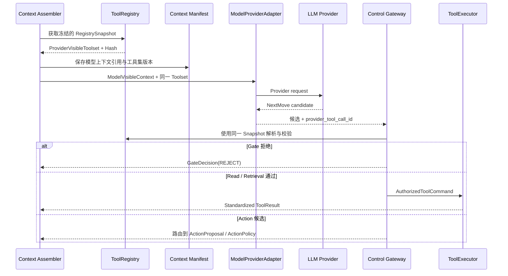

# 消费者订单与配送售后 Agent｜Tool Calling Design Reference

更新日期：2026-07-26  
状态：P0 规范性设计参考  
适用范围：P0 Tool Registry、模型可见 ToolSpec、Control Gateway、ToolExecutor、ToolCall 生命周期、超时与中断、Trace 和 Eval  
关联基线：[PROJECT_DIRECTION.md](../../PROJECT_DIRECTION.md) 第 4、5、6、10、11 节

> 本文定义 P0 目标契约，不表示仓库中已经存在可运行的 ToolRegistry、ToolExecutor、Provider Adapter、持久化实现或自动化测试。

本文定义 P0 售后 Agent 的工具调用机制。它不把 Tool Calling 设计成模型可以直接执行任意代码的能力，也不把项目扩展为通用 Agent Runtime、动态插件平台或 Workflow 引擎。

文中的“必须”“不得”表示 P0 约束；“可以”“建议”表示允许按实现与 Eval 结果调整。

## 1. 文档所有权与适用边界

本文是 P0 Tool Calling 专项设计 owner，负责回答：

- `ToolRegistry`、`ToolExecutor`、Provider Adapter 和 `Control Gateway` 如何分工。
- 工具如何在启动时注册、校验、冻结并形成不可变快照。
- 模型实际可见的 ToolSpec 如何投影、映射、计算 Hash 并支持重放。
- 模型提出的 Tool 候选如何经过确定性 Gate 才能执行。
- `provider_tool_call_id`、`tool_call_id` 和副作用幂等身份如何区分。
- ToolCall 如何处理超时、中断、失败、有限重试和结果未知。
- ToolResult 如何进入 Observation、Evidence、Action Ledger 和 Trace。
- 工具调用如何通过 Component、Trajectory 和 E2E Eval 验证。

本文不重新拥有以下语义：

| 范围 | Canonical owner |
|---|---|
| P0 用户目标、两条 E2E、Tool Catalog、Mock 系统、业务验收 | [`docs/business-capabilities.md`](../business-capabilities.md) |
| Runtime 主干、Controlled ReAct 和 ActionPolicy 上位方向 | [`PROJECT_DIRECTION.md`](../../PROJECT_DIRECTION.md) |
| Eval-driven development、通用 EvalCase、Dataset、Grader 与 Gate | [`Agent Evaluation Strategy`](../evaluation/agent-evaluation-strategy.md) |
| P0 Case ID、requirement mapping、Critical failure 与激活状态 | [`P0 Eval Coverage Matrix`](../evaluation/p0-eval-coverage-matrix.md) |
| Request Understanding、`TaskDeltaCandidate`、`InputBinding` 与薄 RequestUnit | [`intent-design-reference.md`](intent-design-reference.md) |
| Run / Task State、Observation、Evidence、Action Ledger 与 Context Manifest | [`memory-design-reference.md`](memory-design-reference.md) |
| Policy Corpus 受控 ingestion、清洗、结构解析、Chunking、Hybrid Retrieval、RRF、Cross-Encoder、Evidence 组装处理与 RAG Eval | [`rag-design-reference.md`](rag-design-reference.md) |
| 当前图形基线及配套视图 | [`docs/architecture/README.md`](README.md) |

发生冲突时：

1. P0 是否支持某个工具、动作或业务结果，以 `business-capabilities.md` 为准。
2. `NextMove` 在 Runtime 主干中的位置和 ActionPolicy 的不可绕过边界，以 `PROJECT_DIRECTION.md` 为准。
3. Request Understanding、Task Delta 和 RequestUnit 语义，以 Intent Design Reference 为准。
4. Observation、Evidence、Action Ledger、Context Manifest 的字段与权威性，以 Memory Design Reference 为准。
5. RAG 内部检索、融合、重排和 Evidence 组装处理，以 RAG Design Reference 为准。
6. 本文只拥有 Tool 调用内部契约，不得借工具机制新增业务范围或改变其他记录域的权威语义。

## 2. P0 核心裁决

P0 Tool Calling 采用以下约束：

1. **模型只提出候选。** 模型输出结构化 `NextMove`，不能直接调用 Handler 或声明工具已经成功。
2. **工具注册与执行统一治理。** `ToolRegistry` 和 `ToolExecutor` 属于同一个 Tool System，但保持独立职责。
3. **启动时冻结工具集。** P0 不允许运行时热注册、覆盖、刷新或删除工具。
4. **模型与 Gate 使用同一快照。** 模型调用之后，`Control Gateway` 不得重新读取另一份“最新工具列表”。
5. **Provider 原生 Tool Calling 只是传输协议。** Provider SDK 不拥有注册、授权、状态迁移、确认、幂等或恢复语义。
6. **可信参数只由服务端注入。** `customer_id`、授权范围、幂等身份和私有资源引用不得由用户或模型提供。
7. **Read 与 Action 失败语义分开。** Read / Retrieval 可以在预算内有限重试；Action 不使用通用自动重试。
8. **ToolResult 不直接控制 Agent。** 工具只能返回标准结果；Runtime 决定记录域、状态更新和下一轮 ReAct。
9. **工具集必须可追溯。** 每次模型调用都能关联到当时真实可见的 ToolSpec 集合。
10. **不建设第二套业务路由。** RequestUnit 不保存 `allowed_tools`，Tool Registry 也不是 Capability Registry。
11. **Provider 输出必须再次校验。** Provider 的 Schema、Function Call 或兼容层只能降低传输错误，不能替代项目自己的 Pydantic / Schema 校验与 Control Gateway。
12. **私有资源结果先过归属边界。** 不存在、不属于当前用户或无法确认归属的结果必须在形成 Observation、模型上下文或普通 Trace 前统一归一化，不能让模型看到真实差异。

一句话约束：

> 模型决定“建议下一步做什么”，确定性 Runtime 决定“该建议能否执行、以什么身份执行、结果写到哪里以及失败后如何恢复”。

## 3. P0 Tool System 范围

P0 Tool Catalog 的 canonical owner 是 `docs/business-capabilities.md`。当前派生视图为：

```text
Read / Retrieval
  search_orders
  get_order
  get_shipment
  retrieve_refund_policy
  get_refund_status

Action
  create_refund
```

全部六个 P0 Agent-visible ToolSpec 可以进入 Controlled ReAct；这不表示模型可以直接执行 `create_refund`。Action 必须经过独立的 `PROPOSE_ACTION → 精确确认 → ActionPolicy → AuthorizedActionCommand` 路径。

“Agent-visible”只表示模型能够理解该 Tool / Action 的名称、用途和参数，不要求 Provider 把六个定义全部注册为可直接执行的原生 function。Provider Adapter 可以使用统一结构化 `NextMove` 输出；无论传输方式如何，`effect=ACTION` 都只能形成 `PROPOSE_ACTION` 候选。

P0 调用主链：

```text
Bootstrap 注册并冻结工具
  → Context Assembly
  → 投影 Provider-visible ToolSpec
  → 保存 Context Manifest
  → Model 提出一个 NextMove
  → Control Gateway 确定性校验
  → ToolExecutor 或 ActionPolicy
  → ToolResult 标准化
  → Observation / Evidence / Action Ledger
  → 更新 Run / Task State
  → 下一轮 Controlled ReAct 或安全停止
```

这是一条受控执行链，不是预先固定 Tool 顺序的业务 Workflow。

## 4. 核心概念

| 概念 | 含义 | 是否模型可见 |
|---|---|---:|
| `ToolSpec` | 模型理解工具用途和参数所需的公开定义 | 是 |
| `ToolRegistration` | ToolSpec 与 Runtime 私有执行信息的组合 | 否，只有 ToolSpec 投影可见 |
| `RegistrySnapshot` | 启动阶段完成校验后冻结的注册表视图 | 否 |
| `ProviderVisibleToolset` | 经过 Provider 名称和 Schema 适配后真正发送给模型的工具集合 | 是 |
| `NextMove` | 模型提出的单步候选 | 是模型输出 |
| `GateDecision` | Runtime 对候选执行资格的确定性判定 | 否 |
| `ToolCallRecord` | 一次已通过 Gate 的 Runtime 工具执行记录 | 否 |
| `ToolResult` | ToolExecutor 标准化后的执行结果 | 按最小披露投影 |
| `DecisionActionRecord` | Action 的方案、确认、幂等、执行与恢复记录 | 否 |

### 4.1 ToolSpec 与 ToolRegistration

```text
ToolSpec
  name
  description
  input_schema
  output_schema

ToolRegistration
  tool_spec
  effect: READ | RETRIEVAL | ACTION
  risk
  idempotency
  unknown_result_recovery
  handler_ref
  execution_policy_ref
```

规则：

- `ToolSpec` 是 Agent-visible contract。
- `ToolRegistration` 是 Runtime-private contract。
- `handler_ref`、授权配置、密钥、可信身份和业务系统 Client 不得进入模型上下文或 Context Manifest。
- `execution_policy_ref` 属于 Runtime 执行策略，不改变业务 Tool Catalog。
- Tool Definition、Core-owned Port 和具体 Outbound Adapter 是三个不同概念，不得合并成一个 Provider SDK 对象。

### 4.2 ExecutionPolicy

```text
ExecutionPolicy
  timeout_ms
  max_attempts
  retryable_failure_codes[]
  interrupt_behavior
```

P0 的具体数值由实现和 Eval 决定，但必须满足：

- 每次调用都有有限、明确的 deadline。
- `max_attempts` 不得造成无界重试。
- Action 不使用通用自动重试策略。
- 有效超时不得超过当前 Run 剩余时间预算。

### 4.3 RegistrySnapshot

```text
RegistrySnapshot
  tool_registry_version
  canonical_registrations[]
  provider_visible_toolset
  provider_name_to_canonical_name
  model_visible_toolset_hash
```

`RegistrySnapshot` 是进程内不可变值对象或等价结构，不是独立服务、数据库领域对象或动态版本系统。

### 4.4 三类调用身份

```text
provider_tool_call_id?
tool_call_id
action_id / idempotency_key?
```

- `provider_tool_call_id`：Provider 原生 Tool Calling 协议中的关联 ID；不使用原生协议时可以不存在。
- `tool_call_id`：Runtime 在 Gate 通过后、执行前生成的内部执行 ID。
- `action_id / idempotency_key`：副作用动作的稳定身份，由 ActionPolicy 与 Action Ledger 管理。

三者不得互相替代。特别是：

- 模型或 Provider 生成的 ID 不能授予权限。
- `tool_call_id` 不能作为 `create_refund` 的业务幂等身份。
- Action 重试或对账必须继续使用原 `action_id / idempotency_key`。

## 5. 启动注册、校验与冻结

### 5.1 启动流程

`Bootstrap / Composition Root` 在应用接受 Agent Run 前完成：

1. 装配 P0 ToolRegistration。
2. 校验 canonical tool name 唯一。
3. 校验 `input_schema` 和 `output_schema` 可以被 Runtime 解析。
4. 校验每个工具存在 Handler 或对应 Core-owned Port 实现。
5. 校验 `effect`、风险、幂等和未知结果恢复配置完整。
6. 校验 Provider-visible name 映射唯一且可逆。
7. 校验 ExecutionPolicy 存在且预算有限。
8. 生成 `tool_registry_version`。
9. 形成 Provider-visible ToolSpec 投影。
10. 计算 `model_visible_toolset_hash`。
11. 持久化一次可重放的安全 Toolset Artifact。
12. 冻结 `RegistrySnapshot` 后才允许处理模型调用。

以下任一问题必须导致启动失败，而不是运行时静默降级：

- canonical name 重复。
- Provider-visible name 冲突。
- Schema 无效或 Provider 无法表示。
- Handler 缺失。
- Action 缺少幂等或未知结果恢复配置。
- 版本或 Hash 无法生成。

P0 不允许“后注册工具覆盖前注册工具”。

### 5.2 tool_registry_version

`tool_registry_version` 标识本次启动使用的完整 Runtime 注册配置版本。

以下内容变化时必须改变版本：

- ToolRegistration 增删。
- canonical name 或 Provider name mapping 变化。
- `effect`、风险、幂等、未知结果恢复或 ExecutionPolicy 变化。
- Handler 绑定或影响执行语义的实现版本变化。

P0 可以使用随构建或配置发布的显式版本，不建设独立 Registry 版本服务。

### 5.3 Provider-visible 投影

模型看到的是 Provider Adapter 适配后的 ToolSpec，而不一定是 Registry 内的原始结构：

```text
Canonical ToolSpec
  → Provider name mapping
  → Provider Schema adaptation
  → ProviderVisibleToolset
  → Model request
```

因此 `model_visible_toolset_hash` 必须基于最终 Provider-visible 投影计算，不能基于适配前的 Registry 顺序或私有注册信息计算。

### 5.4 Hash 规范

P0 使用确定性 canonical JSON 和 SHA-256 计算：

```text
model_visible_toolset_hash = "sha256:" + sha256(
  canonical_json(
    {
      artifact_schema_version: "model-visible-toolset.p0.v1",
      tools: sort_by_provider_visible_name(
        provider_visible_tool_specs[]
      )
    }
  )
)
```

Hash 输入除固定的 `artifact_schema_version` 外，Tool payload 只包含模型实际可见的内容：

```text
name
description
input_schema
output_schema
```

规范化要求：

- Tool 按 Provider-visible name 稳定排序。
- JSON object key 稳定排序。
- Array 顺序保持业务语义，不任意重排。
- 使用 UTF-8。
- 不包含时间戳、启动顺序或进程随机值。
- 不包含 Handler、`customer_id`、授权信息、密钥、连接配置或其他 Runtime 私有字段。

以下变化必须改变 Hash：

- 模型可见工具集合变化。
- Provider-visible name 变化。
- description 变化。
- input/output Schema 变化。

以下变化不得单独改变 Hash：

- 注册顺序变化。
- Handler 私有实现变化。
- Runtime 认证信息变化。
- ToolSpec 之外的日志或监控配置变化。

### 5.5 Toolset Artifact 与重放

Hash 只能证明两个工具集是否相同，不能单独恢复 ToolSpec 内容。因此 P0 必须把完整的安全 Provider-visible ToolSpec 投影持久化一次：

```text
ModelVisibleToolsetArtifact
  artifact_schema_version
  model_visible_toolset_hash
  provider_visible_tool_specs[]
```

规则：

- Artifact 以 `model_visible_toolset_hash` 作为内容地址或唯一键。
- 相同 Hash 只需保存一次，不在每次模型调用中重复复制完整 ToolSpec。
- 同一模型可见 Artifact 可以被多个 `tool_registry_version` 引用；完整 Runtime 注册版本仍由 Context Manifest 单独记录。
- Artifact 可以保存在现有 Trace / Eval 支撑存储中，不建设独立 Snapshot 服务。
- Provider name 到 canonical name 的映射与完整 RegistrySnapshot 属于 Runtime-private / audit-only 信息，不进入普通 Prompt。
- 如果 Artifact 无法持久化或无法按 Hash 解析，系统不得声称支持精确工具集重放。

## 6. 模型调用与同快照校验



强制规则：

1. Context Assembler 必须在模型调用前取得冻结快照。
2. Context Manifest 必须关联该次模型调用实际使用的 Registry 版本和 Toolset Hash。
3. Provider Adapter 必须使用该快照中的 Provider-visible ToolSpec。
4. `Control Gateway` 必须使用同一个快照解析模型返回的名称和参数。
5. 模型调用与 Gate 之间不得重新加载、刷新或替换 Registry。
6. 即使未来出现动态 Tool Retrieval，检索结果也只能优化模型上下文；授权仍由 Registry、Gateway 和 ActionPolicy 决定。
7. 每个 Provider Adapter 必须按该 Provider 实际支持的参数和响应行为实现，不能通过替换 `base_url` 假设结构化输出、严格 Schema、并行调用或状态管理语义兼容。
8. Provider 返回值必须先完成协议状态、候选数量、名称、JSON 和 Pydantic / Schema 校验，再交给 `Control Gateway`；零个、多个或格式非法的候选不得“尽量解析”成可执行 ToolCall。
9. Provider 服务端会话、缓存或内置工具只有在对应 active implementation contract 明确启用时才能使用；它们不得绕开 Context Manifest、项目自有状态或 Tool Registry。

## 7. Provider 名称映射

Provider 可能限制 Tool name 的字符、长度或格式，因此允许：

```text
canonical_tool_name
  ↔ provider_visible_tool_name
```

映射规则：

- canonical name 来自 P0 Tool Catalog。
- Provider-visible name 由 Provider Adapter 确定性生成。
- 同一快照内必须一一映射。
- 映射必须可逆，不能依赖模糊匹配。
- 冲突必须在启动时失败。
- 模型返回未知、不可见或无法映射的名称时，Gateway 必须拒绝。
- 不允许用大小写猜测、前缀猜测或编辑距离自动选择 Handler。
- Trace 同时记录模型请求的 Provider name 和成功解析后的 canonical name。

## 8. NextMove 与 Control Gateway

### 8.1 模型输出边界

Controlled ReAct 每轮只提出一个结构化 `NextMove`：

```text
CALL_TOOL
ASK_USER
PROPOSE_ACTION
FINISH
ESCALATE
```

`CALL_TOOL` 候选至少表达：

```text
model_call_id
provider_tool_call_id?
requested_tool_name
arguments
base_task_state_version: int | null
```

这些字段仍然只是候选，不能直接触发 Handler。`base_task_state_version` 表示模型在对应 Context Manifest 中实际看到的 Task 版本；只有当前消息尚未绑定既有 Task，且同一输出中的 accepted `ADD_GOAL` 将创建新 Task 时，候选与 Manifest 的 Task 版本都可以为空。模型不得使用伪造的 `0` 版本或猜测 Reducer 将写入的新版本。Reducer 完成后的当前版本由 Runtime 重新校验并记录为 `validated_task_state_version`。

### 8.2 GateDecision

```text
GateDecision
  gate_decision_id
  model_call_id
  context_manifest_id
  provider_tool_call_id?
  requested_provider_tool_name
  resolved_canonical_tool_name?
  snapshot_match
  registration_valid
  schema_valid
  trusted_field_valid
  argument_binding_valid
  argument_binding_refs[]
  budget_valid
  progress_valid
  proposed_base_task_state_version: int | null
  validated_task_state_version?
  state_version_valid
  action_boundary_valid
  decision: ACCEPT | REJECT
  reason_code?
  decided_at
```

`Control Gateway` 按顺序至少检查：

1. Context Manifest 与本次 Snapshot 是否一致。
2. Provider tool name 是否存在且唯一可映射。
3. canonical tool 是否存在于本次模型可见工具集。
4. 参数是否符合 `input_schema`。
5. 模型是否尝试提供 `customer_id`、授权范围、幂等键等可信字段。
6. 每个模型可见业务参数是否精确绑定到当前有效的 `InputBinding`、`verified_target_ref`、Observation / Evidence 引用或 Action Parameter Binding；只通过 JSON Schema 不足以放行。
7. 当前 Run 的步数、Token、时间和调用预算是否允许。
8. 是否属于重复调用、无进展或已满足停止条件。
9. 候选 `base_task_state_version` 是否等于模型实际看到的 Context Manifest 版本；新 Task 路径必须两者都为空。
10. Task Delta 写入后重新校验得到的 `validated_task_state_version` 是否仍是当前版本，且相关参数绑定未被修正、替换或失效。
11. Tool effect 是否允许走当前路径。

任一检查失败：

- 不生成 `tool_call_id`。
- 不调用 Handler。
- 记录确定性 `reason_code`。
- 根据错误类型进入重新推理、安全停止、`ASK_USER` 或 `ESCALATE`。

参数与当前受控绑定不一致时使用稳定原因，例如：

```text
ARGUMENT_BINDING_MISMATCH
```

旧状态、旧绑定或同次 Delta 后无法安全重验的候选使用稳定版本原因；不得通过改写模型原始候选“修好”后执行。

### 8.3 AuthorizedToolCommand

Gateway 只有在全部检查通过后才能形成 Runtime 内部命令：

```text
AuthorizedToolCommand
  gate_decision_id
  canonical_tool_name
  validated_arguments
  argument_binding_refs[]
  validated_task_state_version
  registry_snapshot_ref
  trusted_context_ref
```

规则：

- `validated_arguments` 是经过 Schema、来源、绑定和版本校验的业务参数，不是模型原始对象的可变引用。
- `argument_binding_refs[]` 只记录安全受控引用；不得复制原始消息、私有业务 payload 或 RuntimePrivateContext。
- `trusted_context_ref` 由 Application / Runtime 解析，模型不可见，也不能成为 Provider 参数。
- ToolExecutor 和 Handler 只消费 `AuthorizedToolCommand` 与服务端注入的可信字段，不直接消费 `NextMove.arguments`。

### 8.4 Action 特殊边界

模型需要执行 `create_refund` 时必须提出 `PROPOSE_ACTION`，不得使用普通 `CALL_TOOL` 绕过 ActionPolicy。

```text
PROPOSE_ACTION
  → 生成并持久化精确 ActionProposal
  → AWAITING_CONFIRMATION
  → 用户确认候选
  → Runtime 精确绑定同一 proposal_hash
  → ActionPolicy
  → AuthorizedActionCommand
  → ToolExecutor
```

如果模型对 `effect=ACTION` 的工具提出普通 `CALL_TOOL`，Gateway 必须以稳定原因拒绝，例如：

```text
ACTION_REQUIRES_PROPOSAL
```

ActionPolicy 的 Evidence、确认、授权、幂等和 `RESULT_UNKNOWN` 语义仍由 PROJECT_DIRECTION 与 Memory Design Reference 管理。

## 9. ToolExecutor 与 ToolCall 生命周期

### 9.1 执行前

Gate 通过后，Runtime 必须：

1. 接收已冻结的 `AuthorizedToolCommand`。
2. 生成 `tool_call_id`。
3. 写入可恢复的 ToolCall 起始记录，并关联 Gate、参数绑定和已校验状态版本。
4. 根据 ToolRegistration 解析 Handler。
5. 从 RuntimePrivateContext 注入可信 `customer_id` 和授权范围。
6. 计算不超过 Run 剩余预算的实际 deadline。
7. 对 Action 关联既有 `action_id / idempotency_key`。
8. 在调用任何 Handler / Business Port / Adapter 前，提交一个原子事务或等价的 durable dispatch fence：
   - 以当前状态为条件把 ToolCall 从 `CREATED` 更新为 `RUNNING`；
   - 追加当前 `ToolAttemptRecord` 并使 `attempt_count` 与之匹配；
   - 对 Action 同时把同一幂等身份的 Action Record / attempt 更新为 `STARTED`。
9. 只有该 fence 成功提交后，才允许向 Handler / Business Port / Adapter 发起调用；提交失败时不得 dispatch。

模型参数不得覆盖服务端可信参数；发生同名字段时必须拒绝，而不是静默接受模型值。

durable dispatch fence 是恢复语义的一部分，不只是物理事务优化。P0 模块化单体可以使用同一数据库事务；后续若拆成不同存储，也必须提供等价的原子性与恢复证据，不能留下“外部调用已经发生，但权威记录仍为 `CREATED`”的崩溃窗口。

### 9.2 ToolCallRecord

```text
ToolCallRecord
  tool_call_id
  run_id
  task_id
  request_unit_id
  model_call_id
  context_manifest_id
  gate_decision_id
  provider_tool_call_id?
  canonical_tool_name
  tool_registry_version
  validated_task_state_version
  argument_binding_refs[]
  effect
  attempt_count
  status
  started_at
  finished_at?
  failure_code?
  timeout_phase?
  interruption_reason?
  result_ref?
```

每次底层尝试单独追加：

```text
ToolAttemptRecord
  tool_call_id
  attempt_no
  started_at
  finished_at?
  outcome?
  failure_code?
  timeout_phase?
  retry_decision?
```

`ToolAttemptRecord` 使用两阶段持久化：

- durable dispatch fence 创建当前 attempt 时，只记录 `tool_call_id`、递增且唯一的 `attempt_no` 与 `started_at`；`finished_at`、`outcome`、`failure_code`、`timeout_phase` 和 `retry_decision` 必须为空。
- 底层调用结束后，以 attempt 尚未完成为条件 finalize 同一条记录；`finished_at` 与 `outcome` 必须同时出现，`failure_code` 只在适用的非成功结果中出现。
- timeout outcome 必须记录可信的 `timeout_phase`；非 timeout outcome 不得借用 timeout phase。是否重试必须由 Runtime 根据受控 failure classification、attempt / Run 预算和 current-state revalidation 形成显式 `retry_decision`，不能由模型或 Handler 自报。
- finalized attempt 的 `retry_decision` 至少要能互斥表达：已安排下一次尝试、不满足重试条件、attempt 预算耗尽、Run 预算耗尽、状态 / 绑定已失效，以及该 outcome 不适用重试。具体序列化 code 可以由 active scoped contract 收窄，但不能合并这些不同语义。
- 新的重试追加新的 `attempt_no`，不得用后一次尝试覆盖或复用先前记录。
- 进程重启发现未完成 attempt 时，保留已持久化的开始事实，并按 ToolCall / Action 恢复规则结束或对账；不得倒填一个未观察到的成功、失败或超时 outcome。
- 后一次 attempt 最终成功不能覆盖前一次 timeout / failure 及其 retry decision；同一 `tool_call_id` 的追加历史必须能够解释最终 ToolCall projection。

`ToolAttemptRecord` 在 P0 persistence registry 中是 `ToolCallRecord` 的 logical
child，不是独立 top-level record。上述 `timeout_phase`、`retry_decision` 与
closed-matrix 变化因此推进父记录逻辑版本：

```text
tool_call_record.p0.v1 → tool_call_record.p0.v2
```

v2 必须保留 parent `tool_call_id`、Run / Task / RequestUnit / Context Manifest /
Gate / InputBinding refs、ToolCall lifecycle、`attempt_count`，以及 child identity
`(tool_call_id, attempt_no)` 和连续 `1..N` closure。v1→v2 只允许下列
deterministic conversion：

| v1 child shape | v2 `timeout_phase` | v2 `retry_decision` |
|---|---|---|
| unfinished attempt | `null` | `null` |
| `SUCCESS` | `null` | `NOT_APPLICABLE` |
| allowlisted `BUSINESS_FAILURE` | `null` | `NOT_RETRYABLE` |
| allowlisted deterministic `SYSTEM_FAILURE` | `null` | `NOT_RETRYABLE` |
| retryable `SYSTEM_FAILURE`，且 exact v1 RegistrySnapshot / ExecutionPolicy 证明 `max_attempts=1` | `null` | `MAX_ATTEMPTS_REACHED` |
| `TIMEOUT + TOOL_CALL_TIMEOUT`，且 parent ToolCall 有 exact timeout phase、policy 证明 `max_attempts=1` | 从 parent 精确复制 | `MAX_ATTEMPTS_REACHED` |
| allowlisted non-retryable `INTERRUPTED` | `null` | `NOT_RETRYABLE` |

任何不命中一行、多个匹配、缺 RegistrySnapshot / ExecutionPolicy、unknown code、
parent / child outcome 或 timeout metadata 矛盾的 v1 aggregate 都使 migration /
startup readiness fail closed；不得重分类、补默认值或选择相近 decision。P0
exact-version-only 规则要求 runtime、writer、strict decoder、recovery reader 与
Eval reader 原子切换到 v2，禁止 v1 / v2 同时作为 active version、read-time
fallback 或静默 downgrade。Activation 前必须冻结显式 v1→v2 conversion、失败
原子性、审计与 rollback fence；physical migration、codec 和 reader / writer
尚未实现，不能从本节推定完成。

普通 ToolCall 状态：

```text
CREATED
RUNNING
SUCCEEDED
FAILED
TIMED_OUT
INTERRUPTED
```

`GATE_REJECTED` 不属于 ToolCall 状态，因为 Gate 拒绝时还没有创建 ToolCall；它属于 `GateDecision`。

`RESULT_UNKNOWN` 是副作用执行的 Action Ledger 状态。ToolExecutor 可以返回 `RESULT_UNKNOWN` outcome，但其权威记录必须写入原 Action Record，不能只停留在通用 ToolCall 日志。

### 9.3 状态迁移

```text
NextMoveProposed
  ├─ GateDecision(REJECT)
  └─ GateDecision(ACCEPT)
       → CREATED
       ├─ INTERRUPTED
       └─ RUNNING
            → SUCCEEDED | FAILED | TIMED_OUT | INTERRUPTED
```

约束：

- `CREATED` 表示起始记录已可靠写入，但 durable dispatch fence 尚未提交，因此任何 Handler / Business Adapter dispatch 都不允许发生；此时 `attempt_count=0`，且不存在 `ToolAttemptRecord`。
- 只有 Runtime 能确定调用仍停留在 `CREATED`、未发生 dispatch 时，才允许直接迁移为 `INTERRUPTED`。该迁移保留 `attempt_count=0`，记录安全的 `interruption_reason`，不得伪造一次底层尝试。
- `RUNNING` 表示至少一次底层尝试已经开始，因此从 `RUNNING` 进入任何终态时 `attempt_count>=1`，并存在对应的追加式 `ToolAttemptRecord`。
- 每个 ToolCall 只能有一个终态。
- 状态只能向前迁移，不能把失败记录覆盖成成功。
- 每次底层尝试使用同一 `tool_call_id`，通过追加的 ToolAttemptRecord 与 `attempt_no` 区分。
- Action 的每次执行尝试还必须追加到同一个 Action Record。
- 状态更新必须使用当前状态 / 版本条件或等效 CAS；恢复进程不得把已经进入终态或已被其他恢复实例认领的记录再次改写。

## 10. 超时、重试与中断

### 10.1 严格超时

实际 deadline 应满足：

```text
effective_timeout =
  min(
    execution_policy.timeout_ms,
    remaining_run_time_budget
  )
```

发生超时时必须记录：

- `tool_call_id`。
- 当前 `attempt_no`。
- 超时发生在 dispatch 前、dispatch 后还是无法判断。
- Tool effect。
- 是否允许重试或必须进入恢复。

不得通过延长单次超时绕过 Run 总预算。

### 10.2 Read / Retrieval 重试

Read / Retrieval 只有同时满足以下条件时才能重试：

- 失败码在 `retryable_failure_codes` 中。
- 仍有调用次数与时间预算。
- 当前 Task State 和资源绑定未失效。
- 重试不会扩大授权范围或披露更多数据。
- 重试具有进展，不是重复相同的确定性失败。

重试不得由模型无限要求；Runtime 负责 `max_attempts`。

每次 retry 必须形成以下持久化顺序：

```text
finalize current ToolAttempt
→ persist retry decision
→ revalidate exact Run / Task / RequestUnit / argument bindings and budgets
→ CAS claim next attempt number
→ append next ToolAttempt under the same tool_call_id
→ dispatch
```

不得先 dispatch 再补写 retry decision 或 attempt fence。进程在任一边界重启时：

- 未完成 attempt 保留为“已开始但 outcome 未知”的事实；Read / Retrieval 不能
  自动伪造失败、timeout 或成功，也不能无条件重新 dispatch。
- 已完成 attempt 且持久化为“不重试”的决定，恢复器不得追加新 attempt。
- 已完成 attempt 且持久化为“安排重试”的决定，恢复器只能在 exact current-state
  revalidation、预算和 CAS 全部通过后追加下一 attempt；失败时终止 retry path，
  不得先追加 attempt 再解释失败。若 owner-scoped exact current Run / Task /
  RequestUnit / binding closure 唯一证明旧 Run 已被更新状态或绑定取代，ToolCall
  终止为 `INTERRUPTED`，retry decision / recovery reason 使用
  `STATE_OR_BINDING_INVALIDATED`，对应 Run 服从 Core Runtime owner 的
  `SUPERSEDED + STATE_OR_BINDING_INVALIDATED` no-result closure；不得生成
  Observation、用户结果或 Task / RequestUnit 写入。若无法唯一证明 obsolete，则不得猜测
  `SUPERSEDED`，必须 fail closed。其他具体 Run terminal result 继续服从 Core
  Runtime / Application mapper owner。
- 恢复不能超过 active `ExecutionPolicy.max_attempts`，不能创建第二个同语义
  ToolCall 来绕过 attempt 预算，也不能对同一个确定性失败形成无进展循环。

每个 Tool 的具体 `timeout_ms`、`max_attempts` 和 exact retryable failure codes
继续由 active scoped implementation contract 拥有，不由本节给出统一数值。

### 10.3 Action 不通用重试

`create_refund` 不使用普通 Read Tool 的自动重试：

- 能确定尚未 dispatch：记录明确失败或超时，由 Runtime 决定是否重新进入 ActionPolicy。
- 已 dispatch 且收到明确失败：写入 `FAILED`。
- 已 dispatch 但结果不确定：写入 `RESULT_UNKNOWN`。
- `RESULT_UNKNOWN` 后冻结同语义新执行，使用原幂等身份调用 `get_refund_status` 对账。

不得仅因为模型再次输出 `create_refund` 而生成新的副作用尝试。

### 10.4 中断

中断可能来自：

- 用户新消息使旧 NextMove 失效。
- Run 被取消或预算耗尽。
- Provider 流被终止。
- 进程关闭或 Handler 调用被取消。
- Action 关键输入版本发生变化。

中断处理：

1. 写入 `ToolCallInterrupted` Trace。
2. 记录中断原因和发生阶段。
3. 使依赖旧结果的推理和待执行动作失效。
4. Read / Retrieval 不生成伪造 Observation。
5. Action 已 dispatch 或无法判断时进入 `RESULT_UNKNOWN`。
6. Provider 原生 Tool Calling 如果要求每个 call 都有配对 result，Adapter 可以生成协议级 `INTERRUPTED` 响应以闭合消息结构。

用户新消息、Task version 或 argument binding 变化并不自动等于
`SUPERSEDED`。只有 owner-scoped exact current-state revalidation 唯一证明当前
Run 已 obsolete 时，Tool owner 才输出
`STATE_OR_BINDING_INVALIDATED` 专项 recovery evidence，并把 Run terminal
映射交给
[Project Direction §9.2](../../PROJECT_DIRECTION.md#92-e2e-01-cycle-2-shared-runtime-owner-alignment)；
Tool 层不得直接写 Task 或伪造用户结果。unknown、重复、非唯一或矛盾 evidence
不得被整理成明确 invalidation reason。

进程重启时，只有第 9.1 节 durable dispatch fence 得到实现和验证，持久化状态 `CREATED` 才能证明未发生 dispatch；恢复逻辑可以按第 9.3 节直接写入 `INTERRUPTED`，保留 `attempt_count=0` 且不追加 `ToolAttemptRecord`。如果状态为 `RUNNING`，必须保留既有 attempt；对于 Action，只要已经 dispatch 或无法确定是否 dispatch，Action Ledger 仍按 `RESULT_UNKNOWN` 处理。通用 ToolCall 的 `INTERRUPTED` 不能替代 Action Ledger 的权威结果，也不能被解释成业务系统明确失败。

协议级 `INTERRUPTED` 响应：

- 只用于修复 Provider 会话协议。
- 不表示业务系统成功或失败。
- 不得形成业务 Observation、Evidence 或 Action 成功记录。

## 11. ToolResult 与记录域

### 11.1 标准结果

```text
ToolResult
  tool_call_id
  canonical_tool_name
  outcome:
    SUCCESS
    BUSINESS_FAILURE
    SYSTEM_FAILURE
    TIMEOUT
    INTERRUPTED
    RESULT_UNKNOWN
  payload?
  error_code?
  retryable
  raw_result_ref?
  observed_at?
  completed_at
```

规则：

- Handler 返回值必须先通过 output validation、资源归属校验和最小披露处理。
- `raw_result_ref` 只能指向受控诊断记录，原始结果不直接进入 Prompt。
- Tool 不得返回“继续调用模型”“直接回复用户”“修改 Task 状态”等流程控制命令。
- ToolResult 不自动成为业务事实、政策依据或动作成功证明。
- 对订单、物流、退款和历史任务等私有资源，`NOT_FOUND`、`NOT_OWNED` 或 `OWNERSHIP_UNVERIFIED` 等内部差异必须在标准结果边界折叠为 `NOT_FOUND_OR_NOT_ACCESSIBLE`；标准结果不得携带真实资源 payload。

### 11.2 结果分流

| Tool 类型 / 结果 | 目标记录域 |
|---|---|
| 已通过归属校验的订单、物流和退款状态查询 | Minimum Disclosure Projection → Observation Normalizer → Observation Record |
| 私有资源不存在、非本人或无法确认归属 | 安全 outcome → `RunResultMapper`；不形成标准 Observation |
| 政策检索 | Evidence Assembler → Evidence Binding |
| `create_refund` 提案、确认、尝试和结果 | Decision & Action Ledger |
| 调用过程、Gate、超时、中断和失败 | Trace |
| 跨轮恢复所需内容 | Task Working Context 只保存对应引用 |

特殊规则：

- `get_refund_status` 的业务状态可以形成 Observation，同时用于原 Action Record 的对账。
- `create_refund` 的 `COMPLETED` 只表示 Mock Refund System 的模拟结果，不代表真实支付渠道到账。
- `TIMEOUT`、`INTERRUPTED` 和 `RESULT_UNKNOWN` 不得被模型改写成成功。
- 未通过归属校验的原始 ToolResult 只能在确有必要时进入受限安全诊断域，不能被 Context Manifest、Memory 或普通 Trace 引用，也不能进入后续模型调用。

## 12. Context Manifest 与 Trace

### 12.1 Context Manifest

Context Manifest 的字段和持久化语义由 Memory Design Reference 管理。Tool Calling 必须向每次模型调用提供：

```text
tool_registry_version
model_visible_toolset_hash
```

含义：

- `tool_registry_version`：本次调用使用的完整 Runtime 注册配置版本。
- `model_visible_toolset_hash`：本次模型实际看到的 Provider-visible ToolSpec 集合摘要，同时可作为 Toolset Artifact 内容地址。

Context Manifest 不保存：

- Handler。
- Provider 密钥。
- `customer_id` 或授权范围。
- 原始 RuntimePrivateContext。
- Tool 原始业务结果。

### 12.2 Trace 关联

推荐事件：

```text
ModelCallStarted
NextMoveProposed
GateDecisionRecorded
ToolCallCreated
ToolCallStarted
ToolAttemptFinished
ToolCallSucceeded
ToolCallFailed
ToolCallTimedOut
ToolCallInterrupted
ToolResultNormalized
```

关联关系：

```text
model_call_id
  → context_manifest_id
  → tool_registry_version
  → model_visible_toolset_hash
  → NextMove
  → GateDecision
  → tool_call_id?
  → ToolResult?
  → Observation / Evidence / ActionRecord?
  → stop_reason
```

Trace 不应在每个事件中复制完整 Context Manifest。事件通过 `context_manifest_id` 关联；为检索进行的受控字段冗余属于存储实现，不改变 canonical contract。

attempt-level timeout、retry decision 与 recovery evidence 优先落在 Tool owner
拥有的专项记录 / event payload 中。本次规则演进不修改 shared `TraceEvent`
structure；Core Runtime / Project Direction owner 已因
`SUPERSEDED + STATE_OR_BINDING_INVALIDATED` 的 closed-matrix 语义变化批准
`trace_event_record.p0.v2` 作为 Cycle 2 目标逻辑版本。该版本不授权 Tool owner
新增共享字段；未来若确需改变共享字段或公共结构，仍必须由 Core Runtime /
Project Direction owner 完成另一份独立影响分析与裁决。

### 12.3 隐私与审计

普通 Trace 不记录：

- 原始 Token。
- 隐藏思维链。
- 不必要的 PII。
- Provider 密钥和 Handler 配置。
- 未经归属验证的私有资源数据。

需要审计的 Runtime-private 映射和配置只能保存在受限记录中，不进入模型或普通 Trace。

## 13. Eval 设计

本节拥有 Tool System 专项 Fixture、指标、行为与 Trace obligations；通用 Case 生命周期、Critical failure、Grader、Gate 和跨组件覆盖服从 [Agent Evaluation Strategy](../evaluation/agent-evaluation-strategy.md) 与 [P0 Eval Coverage Matrix](../evaluation/p0-eval-coverage-matrix.md)。工具专项 Eval 不要求固定完整 Tool 顺序，也不得把尚未实现的 Fixture 视为已运行结果。

### 13.1 Fixture

工具集由 Eval Suite 固定，不要求每个 EvalCase 重复写 Hash：

```text
ToolRegistryFixture
  registry_fixture_ref
  tool_registry_version
  canonical_registrations[]
  provider_visible_tool_specs[]
  computed_model_visible_toolset_hash

EvalCase
  input
  initial_task_state
  expected_tool_behavior
```

Eval 启动时重新计算 Hash，并检查 Fixture 与预期版本一致。

### 13.2 Component Eval

至少验证：

- canonical tool name 唯一。
- Provider name mapping 一一对应。
- mapping 冲突导致启动失败。
- ToolSpec 注册顺序变化不改变 Hash。
- name、description、Schema 或可见集合变化会改变 Hash。
- Runtime 私有字段变化不改变 model-visible Hash。
- 未知、不可见、不可映射工具由 Gateway 拒绝。
- 参数 Schema、可信字段、参数绑定来源、候选版本和 Runtime 重验版本被确定性校验。
- 模型参数与当前 InputBinding 不一致时，以 `ARGUMENT_BINDING_MISMATCH` 拒绝且不创建 ToolCall。
- 同次 Task Delta 后失效的旧 NextMove 不会通过修改候选版本继续执行。
- `CALL_TOOL(create_refund)` 被拒绝并要求 `PROPOSE_ACTION`。
- ToolResult 只能进入允许的记录域。

### 13.3 Trajectory Eval

至少验证：

- 简单订单查询不会固定调用 `get_shipment`。
- Read transient failure 只在预算内有限重试。
- 确定性失败不会无进展重试。
- 超时和中断拥有明确终态与 Trace。
- 用户新消息使旧 Tool 候选失效。
- 模型调用与 Gateway 使用同一个 RegistrySnapshot。
- Provider 协议修复不会伪造 Observation。
- Action 超时或中断不会造成第二次退款。
- `RESULT_UNKNOWN` 使用原幂等身份调用 `get_refund_status`。

### 13.4 E2E Eval

两条 P0 E2E 至少证明：

- E2E-01 的 Read Tool 路径可以动态变化，但订单隔离和最小披露不可绕过。
- E2E-02 的 `create_refund` 不能绕过 Evidence、精确确认、ActionPolicy、幂等和恢复。
- Trace 能从 `model_call_id` 还原模型可见工具集、NextMove、Gate、执行和停止原因。
- 相同 Registry Fixture、模型输入和初始状态可重建同一工具选择环境；Eval 不要求模型每次采用完全相同的合法 Tool 顺序。

## 14. 模块与 Ports & Adapters 所有权

| 模块 | 层 | 职责 |
|---|---|---|
| `ToolRegistry` | Core | 注册契约、启动校验、不可变查询和 Snapshot |
| `ToolExecutor` | Core | ToolCall 生命周期、可信参数注入、预算、超时与结果标准化 |
| `Control Gateway` | Core | NextMove、名称、Schema、预算、进展与 effect 边界 |
| `ActionPolicy` | Core | Action 的 Evidence、确认、授权、幂等和恢复 |
| `ModelPort` | Core-owned Port | 接收模型可见上下文和 ToolSpec，返回结构化候选 |
| `ModelProviderAdapter` | Infrastructure | Provider SDK、名称 / Schema 适配、流式参数组装与协议修复 |
| Business Tool Adapter | Infrastructure | 实现 Core / Application 拥有的 Business Port，调用 P0 Mock 系统 |
| Trace / Artifact Store Adapter | Infrastructure | 持久化 Trace、Context Manifest 和 Toolset Artifact |
| `Bootstrap / Composition Root` | Composition Root | 装配 Registry、Handler、Port、Adapter 和 ExecutionPolicy |

依赖规则：

- Core 不依赖具体 Provider SDK、数据库 Client 或外部业务系统 Client。
- Provider Adapter 不拥有授权、ActionPolicy 或 Task State。
- Business Tool Adapter 不直接调用另一个 Adapter。
- Tool Definition 不等于 Business Port，也不等于 Adapter。
- 只有 Composition Root 可以同时引用 Port 和具体 Adapter 完成装配。

流式 Tool 参数拼接如果 Provider 需要，只能位于 `ModelProviderAdapter`；Core 只接收完成结构校验的候选。

## 15. P0 必须实现

- 统一 ToolRegistry / ToolExecutor 治理。
- 六个 P0 工具的启动注册和完整性校验。
- 不可变 RegistrySnapshot。
- Provider name 映射与冲突失败。
- Provider-visible ToolSpec 的确定性 Hash。
- 可按 Hash 解析的 Toolset Artifact。
- Context Manifest 中的 Registry 版本与 Toolset Hash。
- 模型调用与 Gateway 的同快照校验。
- Runtime 生成的 `tool_call_id`。
- ToolCall 明确终态。
- 严格超时、Read 有限重试和 Action 非通用重试。
- 中断记录与必要的 Provider 协议修复。
- ToolResult 标准化和记录域分流。
- 私有资源归属失败在模型和标准 Observation 之前的统一安全归一化。
- Provider-specific Adapter 的响应结构校验与 canonical `NextMove` 转换。
- ActionPolicy、Action Ledger 与 `RESULT_UNKNOWN` 恢复。
- Tool Calling 的 Component、Trajectory 和 E2E Eval。

## 16. P0 明确不实现

- 独立 RegistrySnapshot 服务。
- 运行时 Tool 热注册、刷新、删除或覆盖。
- 动态插件市场或自动暴露外部 MCP Tool。
- Capability Registry 或 RequestUnit Tool allowlist。
- Tool Retrieval。
- 并行 ToolCall。
- Read 与 Action 共用的通用重试策略。
- Action 失败后的盲目重试。
- Tool 返回值直接控制 Agent 流程。
- 完整 Event Sourcing。
- 通用 Workflow DSL 或 DAG。
- 独立 Tool 微服务拆分。

## 17. 尚待实现阶段裁决

以下内容除 active scoped implementation contract 已明确裁决的切片外，当前仍为 `OPEN`：

- 具体编程语言、框架和目录结构。
- `ToolRegistration`、`ToolCallRecord` 和 Toolset Artifact 的物理表结构。
- 各工具的具体 `timeout_ms`、Read `max_attempts` 和 transient failure code。
- Provider SDK、模型和结构化输出实现。
- 是否需要 Provider 流式 Tool 参数组装。
- Trace Store 与 Toolset Artifact 的具体持久化技术。
- Context Manifest、ToolCall 与 Trace 记录的事务拆分。

这些实现选择不得改变本文的确定性边界，也不得引入动态 Capability 路由或 Action 自动重试。

`E2E01-01/04` 的首个具体选择见 [E2E-01 Thin Slice Implementation Spec](../implementation/e2e01-thin-slice-implementation-spec.md)；其中 Python、Qwen 和具体 Schema 只约束该切片，不覆盖本节的通用 Tool System 语义。

`E2E01-02/03/05/06` 在
[E2E-01 Cycle 2 Implementation Spec](../implementation/e2e01-cycle2-implementation-spec.md)
正式 Activation 后，可以 scoped 拥有 `search_orders` / `get_shipment` 的
Agent-visible Schema、Runtime-private Query / Result、具体 producer
implementation、canonical bytes、具体 `timeout_ms` / `max_attempts`、exact
retryable failure codes 及测试向量。Business owner 仍拥有 source authority 语义和
Order → active Package 的业务基数；具体 Infrastructure Adapter 类不是业务
canonical owner。该条件式 delegation 不改变四个 Case 当前的
`CONTRACT_DEFINED` lifecycle，也不证明任何 DTO、Executor、Adapter 或测试已经
实现。

## 18. P0 验收清单

- [ ] P0 六个工具全部通过启动注册检查。
- [ ] 重复 canonical name 或 Provider name mapping 冲突导致启动失败。
- [ ] RegistrySnapshot 在启动完成后不可修改。
- [ ] 模型调用和 Gateway 使用同一 Snapshot。
- [ ] Context Manifest 能关联 Registry 版本与模型可见 Toolset Hash。
- [ ] Hash 能解析到当时完整的 Provider-visible ToolSpec Artifact。
- [ ] ToolSpec 注册顺序变化不改变 Hash。
- [ ] 未注册、不可见或 Schema 无效的候选不会调用 Handler。
- [ ] 模型不能提供或覆盖 `customer_id`、授权范围或幂等身份。
- [ ] 模型可见业务参数可追溯到当前有效的 InputBinding 或其他受控引用；绑定不一致不会创建 ToolCall。
- [ ] 模型看到的 Task 版本与 Runtime 重验版本分开记录，旧 NextMove 不会在状态变化后被静默改写并执行。
- [ ] ToolExecutor 和 Handler 只消费 AuthorizedToolCommand，不直接消费模型原始参数对象。
- [ ] `provider_tool_call_id`、`tool_call_id` 和 Action 幂等身份分开。
- [ ] 所有已执行 ToolCall 都有明确终态。
- [ ] Read 重试受次数、时间和进展预算约束。
- [ ] Action 超时或中断不会触发第二次退款。
- [ ] Provider 返回的零个、多个、未知或 Schema 无效候选不会被转换为可执行 ToolCall。
- [ ] Provider 协议修复不会形成伪造 Observation 或成功结果。
- [ ] 私有资源归属失败在模型和标准 Observation 之前统一归一化，真实差异不进入 Context Manifest、Memory 或普通 Trace。
- [ ] ToolResult 分别进入 Observation、Evidence、Action Ledger 和 Trace。
- [ ] Trace 能从 `model_call_id` 还原工具集、Gate、ToolCall、结果和停止原因。
- [ ] Component、Trajectory 和两条 P0 E2E 均覆盖工具调用机制。
